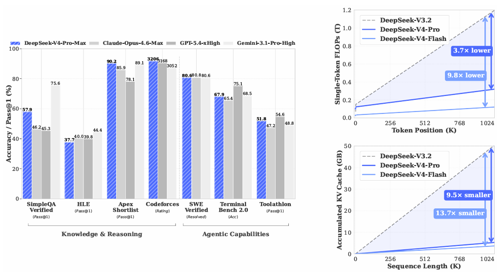
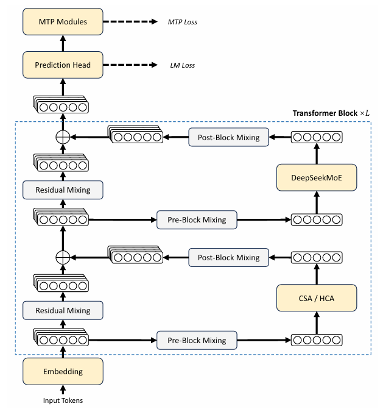
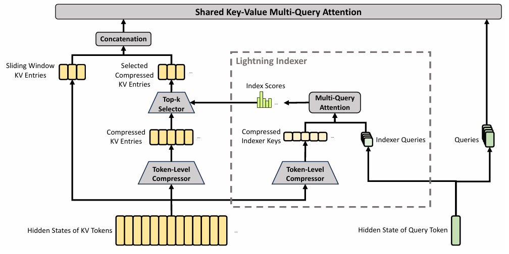
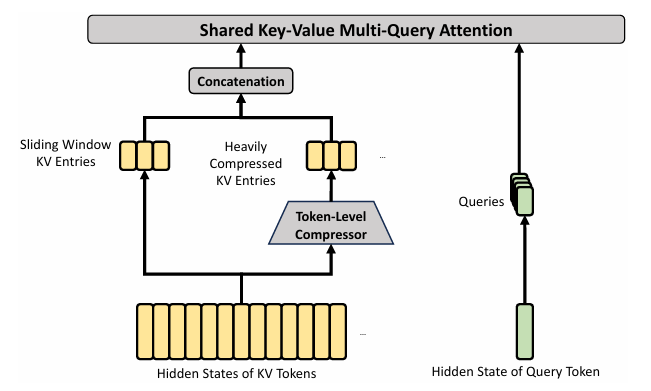

# DeepSeek-V4: Towards Highly Efficient Million-Token Context Intelligence

## Abstract
We present a preview version of DeepSeek-V4 series, including two strong Mixture-of-Experts (MoE) language models — DeepSeek-V4-Pro with 1.6T parameters (49B activated) and DeepSeek-V4-Flash with 284B parameters (13B activated) — both supporting a context length of one million tokens. DeepSeek-V4 series incorporate several key upgrades in architecture and optimization: (1) a hybrid attention architecture that combines Compressed Sparse Attention (CSA) and Heavily Compressed Attention (HCA) to improve long-context efficiency; (2) Manifold-Constrained Hyper-Connections (mHC) that enhance conventional residual connections; (3) and the Muon optimizer for faster convergence and greater training stability. We pre-train both models on more than 32T diverse and high-quality tokens, followed by a comprehensive post-training pipeline that unlocks and further enhances their capabilities. DeepSeek-V4-Pro-Max, the maximum reasoning effort mode of DeepSeek-V4-Pro, redefines the state-of-the-art for open models, outperforming its predecessors in core tasks. Meanwhile, DeepSeek-V4 series are highly efficient in long-context scenarios. In the one-million-token context setting, DeepSeek-V4-Pro requires only 27% of single-token inference FLOPs and 10% of KV cache compared with DeepSeek-V3.2. This enables us to routinely support one-million-token contexts, thereby making long-horizon tasks and further test-time scaling more feasible. The model checkpoints are available at https://huggingface.co/collections/deepseek-ai/deepseek-v4.

> 
> *Figure 1 | Left: benchmark performance of DeepSeek-V4-Pro-Max and its counterparts. Right: inference FLOPs and KV cache size of DeepSeek-V4 series and DeepSeek-V3.2.*

---
## 1. Introduction

The emergence of reasoning models (DeepSeek-AI, 2025; OpenAI, 2024c) has established a new paradigm of test-time scaling, driving substantial performance gains for Large Language Models (LLMs). However, this scaling paradigm is fundamentally constrained by the quadratic computational complexity of the vanilla attention mechanism (Vaswani et al., 2017), which creates a prohibitive bottleneck for ultra-long contexts and reasoning processes. Concurrently, the emergence of long-horizon scenarios and tasks — from complex agentic workflows to massive cross-document analysis — has also made efficient support for ultra-long contexts critical for future progress. While recent open-source efforts (Bai et al., 2025a; DeepSeek-AI, 2024; MiniMax, 2025; Qwen, 2025) have advanced general capabilities, this core architectural inefficiency in handling ultra-long sequences remains a key impediment, limiting further gains from test-time scaling and hindering further exploration into long-horizon scenarios and tasks.

In order to break the efficiency barrier in ultra-long contexts, we develop the DeepSeek-V4 series, including the preview versions of DeepSeek-V4-Pro with 1.6T parameters (49B activated) and DeepSeek-V4-Flash with 284B parameters (13B activated). Through architectural innovations, DeepSeek-V4 series achieve a dramatic leap in computational efficiency for processing ultra-long sequences. This breakthrough enables efficient support for a context length of one million tokens, ushering in a new era of million-length contexts for next-generation LLMs. We believe our capability to efficiently handle ultra-long sequences unlocks the next frontier of test-time scaling, paves the way for deeper research into long-horizon tasks, and establishes a necessary foundation for exploring future paradigms like online learning.

Compared with the DeepSeek-V3 architecture (DeepSeek-AI, 2024), DeepSeek-V4 series retain the DeepSeekMoE framework (Dai et al., 2024) and Multi-Token Prediction (MTP) strategy, while introducing several key innovations in architecture and optimization. To enhance long-context efficiency, we design a hybrid attention mechanism combining Compressed Sparse Attention (CSA) and Heavily Compressed Attention (HCA). CSA compresses the KV caches along the sequence dimension and then performs DeepSeek Sparse Attention (DSA) (DeepSeek-AI, 2025), whereas HCA applies more aggressive compression to the KV caches but keeps dense attention. To strengthen modeling capability, we incorporate Manifold-Constrained Hyper-Connections (mHC) (Xie et al., 2026) that upgrade conventional residual connections. Additionally, we introduce the Muon (Jordan et al., 2024; Liu et al., 2025) optimizer to the training of DeepSeek-V4 series, leading to faster convergence and improved training stability.

To enable efficient training and inference for DeepSeek-V4 series as well as productive development, we introduce several infrastructure optimizations. First, we design and implement a single fused kernel for MoE modules that fully overlaps computation, communication, and memory access. Second, we employ TileLang (Wang et al., 2026), a Domain-Specific Language (DSL) to balance development productivity and runtime efficiency. Third, we provide efficient batch-invariant and deterministic kernel libraries to ensure bitwise reproducibility across training and inference. Fourth, we incorporate FP4 quantization-aware training for MoE expert weights and the indexer QK path to reduce memory and computation. Fifth, for the training framework, we extend the autograd framework with tensor-level checkpointing for fine-grained recomputation control; and we enhance training efficiency with a hybrid ZeRO strategy for the Muon optimizer, cost-effective mHC implementations via recomputation and fused kernels, and two-stage contextual parallelism to manage compressed attention. Finally, for the inference framework, we design a heterogeneous KV cache structure with on-disk storage strategies to enable efficient shared-prefix reuse.

By employing hybrid CSA and HCA, along with precision optimizations on computation and storage, DeepSeek-V4 series achieve significantly lower inference FLOPs and a substantially reduced KV cache size compared with DeepSeek-V3.2, especially in long-context settings. The right part of Figure 1 demonstrates the estimated single-token inference FLOPs and accumulated KV cache size of DeepSeek-V3.2 and DeepSeek-V4 series. In the scenario of 1M-token context, even DeepSeek-V4-Pro, which has a larger number of activated parameters, attains only 27% of the single-token FLOPs (measured in equivalent FP8 FLOPs) and 10% of the KV cache size relative to DeepSeek-V3.2. Furthermore, DeepSeek-V4-Flash, with its smaller number of activated parameters, pushes efficiency even further: in the 1M-token context setting, it achieves only 10% of the single-token FLOPs and 7% of the KV cache size compared with DeepSeek-V3.2. Additionally, for DeepSeek-V4 series, the routed expert parameters utilize FP4 precision. While the peak FLOPs for FP4 × FP8 operations are currently the same as FP8 × FP8 on existing hardware, they can theoretically be implemented to be 1/3 more efficient on future hardware, which will further enhance the efficiency of DeepSeek-V4 series.

During pre-training, we train DeepSeek-V4-Flash on 32T tokens and DeepSeek-V4-Pro on 33T tokens, respectively. After pre-training, these two models can natively and efficiently support 1M-length contexts. In our internal evaluations, DeepSeek-V4-Flash-Base already surpasses DeepSeek-V3.2-Base across a majority of benchmarks with its more parameter-efficient design. DeepSeek-V4-Pro-Base further extends this advantage to set a new performance standard among DeepSeek foundation models, achieving comprehensive superiority across reasoning, coding, long-context, and world knowledge tasks.

The post-training pipeline of DeepSeek-V4 series features a two-stage paradigm: the independent cultivation of domain-specific experts, followed by unified model consolidation via on-policy distillation (Lu and Lab, 2025). Initially, for each target domain — such as mathematics, coding, agent, and instruction following — a separate expert model is trained independently. The base model first undergoes Supervised Fine-Tuning (SFT) on high-quality, domain-specific data to establish foundational capabilities. Subsequently, Reinforcement Learning (RL) is applied using Group Relative Policy Optimization (GRPO) (DeepSeek-AI, 2025), which further optimizes the model for domain-aligned behaviors guided by reward models tailored to specific success criteria. This phase yields a diverse set of specialized experts, each excelling in its respective field. Finally, to integrate these distinct proficiencies, a single unified model is trained through on-policy distillation, wherein the unified model acts as the student learning to optimize the reverse KL loss with teacher models.

**Summary of Core Evaluation Results**
*   **Knowledge:** In assessments of broad world knowledge, DeepSeek-V4-Pro-Max, the maximum reasoning effort mode of DeepSeek-V4-Pro, significantly outperforms leading open-source models on the SimpleQA (OpenAI, 2024d) and Chinese-SimpleQA (He et al., 2024) benchmarks. Regarding educational knowledge — evaluated via MMLU-Pro (Wang et al., 2024b), HLE (Phan et al., 2025), and GPQA (Rein et al., 2023) — DeepSeek-V4-Pro-Max shows a marginal lead over its open-source counterparts. DeepSeek-V4-Pro-Max has significantly closed the gap with the leading proprietary model, Gemini-3.1-Pro, despite still trailing it in these knowledge-based evaluations.
*   **Reasoning:** Through the expansion of reasoning tokens, DeepSeek-V4-Pro-Max demonstrates superior performance relative to GPT-5.2 and Gemini-3.0-Pro on standard reasoning benchmarks. Nevertheless, its performance falls marginally short of GPT-5.4 and Gemini-3.1-Pro, suggesting a developmental trajectory that trails state-of-the-art frontier models by approximately 3 to 6 months. Furthermore, DeepSeek-V4-Flash-Max achieves comparable performance to GPT-5.2 and Gemini-3.0-Pro, establishing itself as a highly cost-effective architecture for complex reasoning tasks.
*   **Agent:** On public benchmarks, DeepSeek-V4-Pro-Max is on par with leading open-source models, such as Kimi-K2.6 and GLM-5.1, but slightly worse than frontier closed models. In our internal evaluation, DeepSeek-V4-Pro-Max outperforms Claude Sonnet 4.5 and approaches the level of Opus 4.5.
*   **Long-Context:** DeepSeek-V4-Pro-Max delivers strong results on synthetic and real use cases with a 1-million-token context window, surpassing even Gemini-3.1-Pro on academic benchmarks.
*   **DeepSeek-V4-Pro v.s. DeepSeek-V4-Flash:** DeepSeek-V4-Flash-Max exhibits lower performance in knowledge evaluations due to its smaller parameter scale. However, it achieves comparable results on reasoning tasks when allocated a larger thinking budget. In agent evaluations, while DeepSeek-V4-Flash-Max matches the performance of DeepSeek-V4-Pro-Max on several benchmarks, it still trails its larger counterpart on more complex, high-difficulty tasks.

> 
> *Figure 2 | Overall architecture of DeepSeek-V4 series. We use hybrid CSA (Compressed Sparse Attention) and HCA (Heavily Compressed Attention) for attention layers, DeepSeekMoE for feed-forward layers, and strengthen conventional residual connections with mHC.*

## 2. Architecture

Overall, DeepSeek-V4 series retain the Transformer (Vaswani et al., 2017) architecture and Multi-Token Prediction (MTP) modules (DeepSeek-AI, 2024; Gloeckle et al., 2024), while introducing several key upgrades over DeepSeek-V3: (1) firstly, we introduce the Manifold-Constrained Hyper-Connections (mHC) (Xie et al., 2026) to strengthen conventional residual connections; (2) secondly, we design a hybrid attention architecture, which greatly improves long-context efficiency through Compressed Sparse Attention and Heavily Compressed Attention. (3) thirdly, we employ Muon (Jordan et al., 2024; Liu et al., 2025) as the optimizer. For the Mixture-of-Experts (MoE) components, we still adopt the DeepSeekMoE (Dai et al., 2024) architecture, with only minor adjustments from DeepSeek-V3. The Multi-Token Prediction (MTP) (DeepSeek-AI, 2024; Gloeckle et al., 2024; Li et al., 2024; Qi et al., 2020) configuration remains identical to that of DeepSeek-V3. All other unspecified details follow the settings established in DeepSeek-V3 (DeepSeek-AI, 2024). Figure 2 illustrates the overall architecture of DeepSeek-V4, and the details are described below.

### 2.1. Designs Inherited from DeepSeek-V3

**Mixture-of-Experts.** As previous DeepSeek-series models (DeepSeek-AI, 2024; DeepSeek-AI, 2024), DeepSeek-V4 series also adopt the DeepSeekMoE paradigm (Dai et al., 2024) for Feed-Forward Networks (FFNs), which sets fine-grained routed experts and shared experts. Different from DeepSeek-V3, we change the activation function that computes the affinity scores from Sigmoid($\cdot$) into Sqrt(Softplus($\cdot$)). For load balancing, we also employ the auxiliary-loss-free strategy (DeepSeek-AI, 2024; Wang et al., 2024a), augmented by a slight sequence-wise balance loss that prevents extreme imbalance within individual sequences. For DeepSeek-V4, we remove the constraint on the number of routing target nodes, and carefully redesign the parallelism strategy to maintain training efficiency. Furthermore, compared with DeepSeek-V3, we replace the dense FFN layers in the initial several Transformer blocks with MoE layers that employ Hash routing (Roller et al., 2021). The Hash routing strategy determines the target experts of each token according to a predefined hash function with regard to the input token ID.

**Multi-Token Prediction.** As DeepSeek-V3, DeepSeek-V4 series also set MTP modules and objectives. Given that the MTP strategy has been validated in DeepSeek-V3, we adopt the same strategy for DeepSeek-V4 series without modification.

### 2.2. Manifold-Constrained Hyper-Connections

As shown in Figure 2, DeepSeek-V4 series incorporate Manifold-Constrained Hyper-Connections (mHC) (Xie et al., 2026) to strengthen the conventional residual connections between adjacent Transformer blocks. Compared with naive Hyper-Connections (HC) (Zhu et al., 2025), the core idea of mHC is to constrain the residual mapping onto a specific manifold, and thus enhance the stability of signal propagation across layers while preserving model expressivity. This subsection briefly introduces the standard HC and describes how we design mHC for stable training.

**Standard Hyper-Connections.** The standard HC expands the width of the residual stream by a factor of $n_{hc}$. Specifically, the shape of the residual stream is expanded from $\mathbb{R}^d$ to $\mathbb{R}^{n_{hc} \times d}$, where $d$ is the hidden size of the actual layer input. Let $X_l = [\mathbf{x}_{l,1}; \dots ; \mathbf{x}_{l,n_{hc}}]^T \in \mathbb{R}^{n_{hc} \times d}$ be the residual state before the $l$-th layer. HC introduces three linear mappings: an input mapping $A_l \in \mathbb{R}^{1 \times n_{hc}}$, a residual transformation $B_l \in \mathbb{R}^{n_{hc} \times n_{hc}}$, and an output mapping $C_l \in \mathbb{R}^{n_{hc} \times 1}$. The update of the residual state is then formulated as:

$$X_{l+1} = B_l X_l + C_l \mathcal{F}_l(A_l X_l), \tag {1}$$

where $\mathcal{F}_l$ denotes the $l$-th layer (e.g., an MoE layer), whose input and output shapes are both $\mathbb{R}^d$. Note that the actual layer input $A_l X_l \in \mathbb{R}^d$ is also $d$-dimensional, so the expanded residual width does not influence the design of the inner layers. HC decouples the residual width from the actual hidden size, offering a complementary scaling axis with minimal computational overhead, as $n_{hc}$ is typically much smaller than the hidden size $d$. However, even though HC has demonstrated potential in improving model performance, we find that the training will frequently exhibit numerical instability when stacking multiple layers, which hinders the scaling of HC.

**Manifold-Constrained Residual Mapping.** The core innovation of mHC is to constrain the residual mapping matrix $B_l$ to the manifold of doubly stochastic matrices (the Birkhoff polytope) $\mathcal{M}$, and thus enhance the stability of signal propagation across layers:

$$B_l \in \mathcal{M} := \{M \in \mathbb{R}^{n \times n} \mid M\mathbf{1}_n = \mathbf{1}_n, \mathbf{1}_n^T M = \mathbf{1}_n^T, M \ge 0\}. \tag {2}$$

This constraint ensures that the spectral norm of the mapping matrix $\|B_l\|_2$ is bounded by 1, so the residual transformation is non-expansive, which increases the numerical stability during both the forward pass and backpropagation. Besides, the set $\mathcal{M}$ is closed under multiplication, which guarantees stability in the scenarios of deep stacks of mHC. In addition, the input transformation $A_l$ and output transformation $C_l$ are also constrained to be non-negative and bounded via a Sigmoid function to avoid the risk of signal cancellation.

**Dynamic Parameterization.** The parameters of three linear mappings are dynamically generated, which are decomposed into a dynamic (input-dependent) component and a static (input-independent) component. Given the input $X_l \in \mathbb{R}^{n_{hc} \times d}$, it is first flattened and normalized: $\hat{X}_l = \text{RMSNorm}(\text{vec}(X_l)) \in \mathbb{R}^{1 \times n_{hc} d}$. Then, we follow the conventional HC to generate the unconstrained raw parameters $\tilde{A}_l \in \mathbb{R}^{1 \times n_{hc}}$, $\tilde{B}_l \in \mathbb{R}^{n_{hc} \times n_{hc}}$, and $\tilde{C}_l \in \mathbb{R}^{n_{hc} \times 1}$:

$$\tilde{A}_l = \alpha_l^{\text{pre}} \cdot (\hat{X}_l W_l^{\text{pre}}) + S_l^{\text{pre}}, \tag {3}$$
$$\tilde{B}_l = \alpha_l^{\text{res}} \cdot \text{Mat}(\hat{X}_l W_l^{\text{res}}) + S_l^{\text{res}}, \tag{4}$$
$$\tilde{C}_l = \alpha_l^{\text{post}} \cdot (\hat{X}_l W_l^{\text{post}})^T + S_l^{\text{post}}, \tag {5}$$

where $W_l^{\text{pre}}, W_l^{\text{post}} \in \mathbb{R}^{n_{hc} d \times n_{hc}}$ and $W_l^{\text{res}} \in \mathbb{R}^{n_{hc} d \times n_{hc}^2}$ are learnable parameters for generating the dynamic components; $\text{Mat}(\cdot)$ reshapes a vector of size $1 \times n_{hc}^2$ into a matrix of size $n_{hc} \times n_{hc}$; $S_l^{\text{pre}} \in \mathbb{R}^{1 \times n_{hc}}$, $S_l^{\text{post}} \in \mathbb{R}^{n_{hc} \times 1}$, and $S_l^{\text{res}} \in \mathbb{R}^{n_{hc} \times n_{hc}}$ are learnable static biases; and $\alpha_l^{\text{pre}}, \alpha_l^{\text{res}}, \alpha_l^{\text{post}} \in \mathbb{R}$ are learnable gating factors initialized to small values.

**Applying Parameter Constraints.** After obtaining the unconstrained raw parameters $\tilde{A}_l, \tilde{B}_l, \tilde{C}_l$, we then apply constraints described earlier to them to enhance the numerical stability. To be specific, for the input and output mappings, we employ a Sigmoid function $\sigma(\cdot)$ to ensure their non-negativity and boundedness:

$$A_l = \sigma(\tilde{A}_l), \tag {6}$$
$$C_l = 2\sigma(\tilde{C}_l). \tag {7}$$

As for the residual mapping $\tilde{B}_l$, we project it onto the manifold of doubly stochastic matrices $\mathcal{M}$. This is achieved by the Sinkhorn-Knopp algorithm, which first applies an exponential function to $\tilde{B}_l$ to ensure positivity, getting $M^{(0)} = \exp(\tilde{B}_l)$, and then iteratively performs column and row normalization:

$$M^{(t)} = \mathcal{T}_r(\mathcal{T}_c(M^{(t-1)})), \tag {8}$$

where $\mathcal{T}_r$ and $\mathcal{T}_c$ denote row and column normalization, respectively. This iteration converges to a constrained doubly stochastic matrix $B_l = M^{(t_{\max})}$. We choose $t_{\max} = 20$ as a practical value.

> 
> *Figure 3 | Core architectures of CSA. It compresses the number of KV entries to $\frac{1}{m}$ times, and then applies DeepSeek Sparse Attention for further acceleration. Additionally, a small set of sliding window KV entries is combined with the selected compressed KV entries to enhance local fine-grained dependencies.*

### 2.3. Hybrid Attention with CSA and HCA

As the context length reaches extreme scales, the attention mechanism emerges as the dominant computational bottleneck in a model. For DeepSeek-V4, we design two efficient attention architectures — Compressed Sparse Attention (CSA) and Heavily Compressed Attention (HCA) — and employ their interleaved hybrid configuration, which substantially reduces the computational cost of attention in long-text scenarios. CSA integrates both compression and sparse attention strategies: it first compresses the Key-Value (KV) cache of every $m$ tokens into one entry, and then applies DeepSeek Sparse Attention (DSA) (DeepSeek-AI, 2025) where each query token attends to only $k$ compressed KV entries. HCA aims for extreme compression by consolidating the KV cache of every $m'$ ($\gg m$) tokens into a single entry. The hybrid architecture of CSA and HCA remarkably improves the long-context efficiency of DeepSeek-V4 series, making one-million-token context feasible in practice. This subsection describes the core techniques of our hybrid attention architecture, and we also provide an open-source implementation to specify more details unambiguously.

#### 2.3.1. Compressed Sparse Attention

The core architecture of CSA is illustrated in Figure 3, which first compresses the KV cache of each $m$ tokens into one entry, and then applies DeepSeek Sparse Attention for further acceleration.

**Compressed Key-Value Entries.** Let $H \in \mathbb{R}^{n \times d}$ be a sequence of input hidden states, where $n$ is the sequence length and $d$ is the hidden size. CSA first computes two series of KV entries $C^a, C^b \in \mathbb{R}^{n \times c}$ and their corresponding compression weights $Z^a, Z^b \in \mathbb{R}^{n \times c}$, where $c$ is the head dimension:

$$C^a = H \cdot W^{aKV}, \quad C^b = H \cdot W^{bKV}, \tag {9}$$
$$Z^a = H \cdot W^{aZ}, \quad Z^b = H \cdot W^{bZ}, \tag {10}$$

where $W^{aKV}, W^{bKV}, W^{aZ}, W^{bZ} \in \mathbb{R}^{d \times c}$ are trainable parameters. Next, each $m$ KV entries in $C^a$ and $C^b$ will be compressed into one entry according to their compression weights and learnable positional biases $B^a, B^b \in \mathbb{R}^{m \times c}$, producing $C^{\text{Comp}} \in \mathbb{R}^{\frac{n}{m} \times c}$. Each compressed entry $C^{\text{Comp}}_i \in \mathbb{R}^c$ is computed by

$$[S^a_{mi : m(i+1)-1}; S^b_{m(i-1) : mi-1}] = \text{Softmax}_{\text{row}} ([Z^a_{mi : m(i+1)-1} + B^a; Z^b_{m(i-1) : mi-1} + B^b]), \tag {11}$$
$$C^{\text{Comp}}_i = \sum_{j=mi}^{m(i+1)-1} S^a_j \odot C^a_j + \sum_{j=m(i-1)}^{mi-1} S^b_j \odot C^b_j, \tag {12}$$

where $\odot$ denotes the Hadamard product; $\text{Softmax}_{\text{row}}(\cdot)$ denotes the softmax operation along the row dimension, which performs normalization across the total of $2m$ elements from both $Z^a$ and $Z^b$. When $i=0$, $Z^b_{m(i-1) : mi-1}$ is padded with negative infinity and $C^b_{m(i-1) : mi-1}$ is padded with zeros. Note that each $C^{\text{Comp}}_i$ is derived from $2m$ KV entries, but the indexes of $C^b$ used for $C^{\text{Comp}}_i$ and the indexes of $C^a$ used for $C^{\text{Comp}}_{i-1}$ are overlapped. Therefore, CSA in fact compresses the sequence length to $\frac{1}{m}$ times.

**Lightning Indexer for Sparse Selection.** After obtaining the compressed KV entries $C^{\text{Comp}}$, CSA applies the DSA strategy to select top-k compressed KV entries for core attention. First, CSA performs the same compression operation used for $C^{\text{Comp}}$ to get compressed indexer keys $K^{\text{IComp}} \in \mathbb{R}^{\frac{n}{m} \times c^I}$, where $c^I$ is the indexer head dimension. Then, for a query token $t$, we produce the indexer queries $\{\mathbf{q}^I_{t,1}; \mathbf{q}^I_{t,2}; ...; \mathbf{q}^I_{t,n^I_h}\}$ in a low-rank manner:

$$c^Q_t = \mathbf{h}_t \cdot W^{DQ}, \tag {13}$$
$$[\mathbf{q}^I_{t,1}; \mathbf{q}^I_{t,2}; ...; \mathbf{q}^I_{t,n^I_h}] = \mathbf{q}^I_t = c^Q_t \cdot W^{IUQ}, \tag {14}$$

where $\mathbf{h}_t \in \mathbb{R}^d$ is the input hidden state of the query token $t$; $c^Q_t \in \mathbb{R}^{d_c}$ is the compressed latent vector for queries; $d_c$ denotes the query compression dimension; $n^I_h$ denotes the number of indexer query heads; $W^{DQ} \in \mathbb{R}^{d \times d_c}$ and $W^{IUQ} \in \mathbb{R}^{d_c \times c^I n^I_h}$ are the down-projection and up-projection matrices for indexer queries, respectively. Next, the index score $I_{t,s} \in \mathbb{R}$ between the query token $t$ and a preceding compressed block $s$ ($s < \text{Floor}(\frac{t}{m})$) is computed by

$$[w^I_{t,1}; w^I_{t,2}; ...; w^I_{t,n^I_h}] = \mathbf{w}^I_t = \mathbf{h}_t \cdot W^{iw}, \tag {15}$$
$$I_{t,s} = \sum_{h=1}^{n^I_h} w^I_{t,h} \cdot \text{ReLU} \left(\mathbf{q}^I_{t,h} \cdot K^{\text{IComp}}_s\right), \tag {16}$$

where $W^{iw} \in \mathbb{R}^{d \times n^I_h}$ is a learnable matrix; $w^I_{t,h} \in \mathbb{R}$ is the weight of the $h$-th indexer head. For a query token $t$, given its index scores $I_{t,:}$, we employ a top-k selector to selectively retain a subset of compressed KV entries $C^{\text{SprsComp}}_t$ for subsequent core attention:

$$C^{\text{SprsComp}}_t = \left\{ C^{\text{Comp}}_s \mid I_{t,s} \in \text{Top-k}(I_{t,:}) \right\}. \tag {17}$$

> 
> *Figure 4 | Core architectures of HCA. It performs heavier compression, where the KV entries of $m'$ ($\gg m$) tokens will be consolidated into one. Also, we additionally introduce a small set of sliding window KV entries to enhance local fine-grained dependencies.*

**Shared Key-Value MQA.** After selecting the sparse KV entries, CSA then performs core attention in a Multi-Query Attention (MQA) (Shazeer, 2019) manner, where each compressed KV entry in $C^{\text{SprsComp}}_t$ serves as both attention key and value. To be specific, for a query token $t$, we first produce attention queries $\{\mathbf{q}_{t,1}; \mathbf{q}_{t,2}; ...; \mathbf{q}_{t,n_h}\}$ from the compressed latent vector $c^Q_t$:

$$[\mathbf{q}_{t,1}; \mathbf{q}_{t,2}; ...; \mathbf{q}_{t,n_h}] = \mathbf{q}_t = c^Q_t \cdot W^{UQ}, \tag {18}$$

where $n_h$ denotes the number of query heads; $W^{UQ} \in \mathbb{R}^{d_c \times c n_h}$ is the up-projection matrices for queries. Note that the latent query vector $c^Q_t$ is shared with that used for the indexer queries. Next, we perform MQA on $\{\mathbf{q}_{t,i}\}$ and $C^{\text{SprsComp}}_t$:

$$\mathbf{o}_{t,i} = \text{CoreAttn} \left(\text{query}=\mathbf{q}_{t,i}, \text{key}=C^{\text{SprsComp}}_t, \text{value}=C^{\text{SprsComp}}_t \right), \tag {19}$$

where $\mathbf{o}_{t,i} \in \mathbb{R}^c$ is the core attention output of the $i$-th head at the $t$-th token; $\text{CoreAttn}(\cdot)$ denotes the core attention operation.

**Grouped Output Projection.** In the configuration of DeepSeek-V4, $c n_h$ is quite large. Therefore, directly projecting the outputs of the core attention operation $[\mathbf{o}_{t,1}; \mathbf{o}_{t,2}; ...; \mathbf{o}_{t,n_h}] = \mathbf{o}_t \in \mathbb{R}^{c n_h}$ to a $d$-dimensional hidden state will impose a substantial computational burden. To mitigate this cost, we design a grouped output projection strategy. To be specific, we first split $n_h$ outputs into $g$ groups, and then for each group of output $\mathbf{o}^G_{t,i} \in \mathbb{R}^{c \frac{n_h}{g}}$, we project it to a $d_g$-dimensional intermediate output $\mathbf{o}^{G'}_{t,i} \in \mathbb{R}^{d_g}$, where $d_g < c \frac{n_h}{g}$. Finally, we project the intermediate output $[\mathbf{o}^{G'}_{t,1}; \mathbf{o}^{G'}_{t,2}; ...; \mathbf{o}^{G'}_{t,g}] \in \mathbb{R}^{d_g g}$ to the final attention output $\mathbf{\hat{o}}_t \in \mathbb{R}^d$.

#### 2.3.2. Heavily Compressed Attention

The core architecture of HCA is illustrated in Figure 4, which compresses the KV cache in a heavier manner, but does not employ sparse attention.

**Compressed Key-Value Entries.** By and large, the compression strategy of HCA is similar to that of CSA, but employs a larger compression rate $m'$ ($\gg m$) and does not perform overlapped compression. Let $H \in \mathbb{R}^{n \times d}$ be a sequence of input hidden states, HCA first computes the original KV entries $C \in \mathbb{R}^{n \times c}$ and their corresponding compression weights $Z \in \mathbb{R}^{n \times c}$:

$$C = H \cdot W^{KV}, \tag {20}$$
$$Z = H \cdot W^Z, \tag {21}$$

where $W^{KV}, W^Z \in \mathbb{R}^{d \times c}$ are trainable parameters. Next, each $m'$ KV entries in $C$ will be compressed into one according to the compression weights and learnable positional biases $B \in \mathbb{R}^{m' \times c}$, producing $C^{\text{Comp}} \in \mathbb{R}^{\frac{n}{m'} \times c}$. Each compressed entry $C^{\text{Comp}}_i \in \mathbb{R}^c$ is computed by

$$S_{m'i : m'(i+1)-1} = \text{Softmax}_{\text{row}}(Z_{m'i : m'(i+1)-1} + B), \tag {22}$$
$$C^{\text{Comp}}_i = \sum_{j=m'i}^{m'(i+1)-1} S_j \odot C_j. \tag {23}$$

Through this compression operation, HCA compresses the sequence length to $\frac{1}{m'}$ times.

**Shared Key-Value MQA and Grouped Output Projection.** HCA also employs the shared KV MQA and grouped output projection strategies as CSA does. After the KV compression, for a query token $t$, HCA first produces attention queries $\{\mathbf{q}_{t,1}; \mathbf{q}_{t,2}; ...; \mathbf{q}_{t,n_h}\}$ in a low-rank manner:

$$c^Q_t = \mathbf{h}_t \cdot W^{DQ}, \tag {24}$$
$$[\mathbf{q}_{t,1}; \mathbf{q}_{t,2}; ...; \mathbf{q}_{t,n_h}] = \mathbf{q}_t = c^Q_t \cdot W^{UQ}, \tag {25}$$

where $\mathbf{h}_t \in \mathbb{R}^d$ is the input hidden state of the query token $t$; $n_h$ denotes the number of query heads; $W^{DQ} \in \mathbb{R}^{d \times d_c}$ and $W^{UQ} \in \mathbb{R}^{d_c \times c n_h}$ are the down-projection and up-projection matrices for queries, respectively. Next, we perform MQA on $\{\mathbf{q}_{t,i}\}$ and $C^{\text{Comp}}$:

$$\mathbf{o}_{t,i} = \text{CoreAttn}\left(\text{query}=\mathbf{q}_{t,i}, \text{key}=C^{\text{Comp}}, \text{value}=C^{\text{Comp}}\right), \tag {26}$$

where $\mathbf{o}_{t,i} \in \mathbb{R}^c$ is the core attention output of the $i$-th head at the $t$-th token. Next, as CSA does, HCA splits $n_h$ outputs into $g$ groups, and for each group of output $\mathbf{o}^G_{t,i} \in \mathbb{R}^{c \frac{n_h}{g}}$, HCA projects it to a $d_g$-dimensional intermediate output $\mathbf{o}^{G'}_{t,i} \in \mathbb{R}^{d_g}$, where $d_g < c \frac{n_h}{g}$. Finally, HCA projects the intermediate output $[\mathbf{o}^{G'}_{t,1}; \mathbf{o}^{G'}_{t,2}; ...; \mathbf{o}^{G'}_{t,g}] \in \mathbb{R}^{d_g g}$ to the final attention output $\mathbf{\hat{o}}_t \in \mathbb{R}^d$.

#### 2.3.3. Other Details

In addition to the core architectures of CSA and HCA described above, our hybrid attention incorporates several other techniques. For writing clarity, we omit these additional techniques from the above introduction and will briefly describe them in this subsection. Also, this subsection focuses only on the core ideas of them and may omit some tiny details for simplicity. We encourage the readers to refer to our open-source implementation for unambiguous details.

**Query and Key-Value Entry Normalization.** For both CSA and HCA, we perform an additional RMSNorm operation on each head of the queries and the only head of the compressed KV entries, just before the core attention operation. This normalization avoids exploding attention logits and may improve training stability.

**Partial Rotary Positional Embedding.** For both CSA and HCA, we partially employ the Rotary Positional Embedding (RoPE) (Su et al., 2024) to the attention queries, KV entries, and the core attention outputs. To be specific, for each query vector and KV entry vector used in CSA and HCA, we apply RoPE to its last 64 dimensions. Since the KV entries serve as both attention keys and values, the naive core attention outputs $\{\mathbf{o}_{t,i}\}$ will carry absolute position embeddings, derived from the weighted sum of KV entries. As a countermeasure, we also apply RoPE with position $-i$ on the last 64 dimensions of each $\mathbf{o}_{t,i}$. In this way, the output of the core attention will also carry relative position embeddings — the contribution of each KV entry to the core attention outputs will also be related to the distance between the query and the KV entry.

**Additional Branch of Sliding Window Attention.** In order to strictly preserve causality in CSA and HCA, each query attends to only preceding compressed KV blocks. Consequently, a query cannot access information from other tokens within its own compressed block. Meanwhile, recent tokens usually possess greater relevance to the query token in language modeling. For these reasons, we introduce a supplementary attention branch to both CSA and HCA in a sliding window manner, for better modeling of local dependencies. To be specific, for each query token, we additionally produce $n_{\text{win}}$ uncompressed KV entries corresponding to the recent $n_{\text{win}}$ tokens. In the core attention of CSA and HCA, these KV entries in the sliding window will be used along with the compressed KV entries.

**Attention Sink.** In the core attention of CSA and HCA, we employ the trick of attention sink (OpenAI, 2025; Xiao et al., 2024). To be specific, we set a series of learnable sink logits $\{z'_1, z'_2, ..., z'_{n_h}\}$. For the $h$-th attention head, $\text{Exp}(z'_h)$ will be added to the denominator of the attention score:

$$s_{h,i,j} = \frac{\text{Exp}(z_{h,i,j})}{\sum_k \text{Exp}(z_{h,i,k}) + \text{Exp}(z'_h)}, \quad (27)$$

where $s_{h,i,j}, z_{h,i,j} \in \mathbb{R}$ denote the attention score and attention logit of the $h$-th attention head between the $i$-th query token and the $j$-th preceding token or compressed block. This technique allows each query head to adjust its total attention scores to be not equal to 1, and even to be near 0.

#### 2.3.4. Efficiency Discussion

Due to the employment of hybrid CSA and HCA, together with low-precision computation and storage, the attention module of DeepSeek-V4 series achieves remarkable efficiency in both attention FLOPs and KV cache size, especially in long-context scenarios. First, we adopt a mixed storage format for KV entries: BF16 precision is used for the rotary positional embedding (RoPE) dimensions, while FP8 precision is applied to the remaining dimensions. This hybrid representation reduces the KV cache size by nearly half compared with pure BF16 storage. Second, attention computation within the lightning indexer is performed in FP4 precision, which accelerates the attention operation under extremely long contexts. Third, relative to DeepSeek-V3.2, a smaller attention top-k is chosen in DeepSeek-V4 series, thereby improving model efficiency on short- and medium-length texts. Finally, and most importantly, compressed attention and hybrid attention techniques substantially reduce both the KV cache size and the computational FLOPs.

Taking BF16 GQA8 (Ainslie et al., 2023) with a head dimension of 128 as the baseline — one of the common configurations of LLM attention — the KV cache size of DeepSeek-V4 series can be dramatically reduced to approximately 2% times of that baseline in the 1M-context setting.

```text
Algorithm 1 Muon Optimizer for DeepSeek-V4
Require: Learning rate η, momentum μ, weight decay λ, update rescaling factor γ
1: for each training step t do
2:     for each logically independent weight W ∈ R^{n×m} do
3:         G_t = ∇_W \mathcal{L}_t(W_{t−1})                                   ▹ Compute gradients
4:         M_t = μM_{t−1} + G_t                                           ▹ Accumulate momentum buffer
5:         O'_t = HybridNewtonSchulz(μM_t + G_t)  ▹ Nesterov trick and hybrid Newton-Schulz
6:         O_t = O'_t · \sqrt{\max(n, m)} · γ                             ▹ Rescale the update RMS
7:         W_t = W_{t−1} · (1 − ηλ) − ηO_t                                ▹ Perform weight decay and update
8:     end for
9: end for
```

Moreover, even when compared with DeepSeek-V3.2 (DeepSeek-AI, 2025) — already an efficient baseline — DeepSeek-V4 series still exhibits substantial advantages in efficiency. A comparison of their inference FLOPs and KV cache size is provided in the right part of Figure 1.

### 2.4. Muon Optimizer

We employ the Muon (Jordan et al., 2024; Liu et al., 2025) optimizer for the majority of modules in DeepSeek-V4 series due to its faster convergence and improved training stability. The full algorithm of our Muon optimization is summarized in Algorithm 1.

**Basic Configurations.** We maintain the AdamW (Loshchilov and Hutter, 2017) optimizer for the embedding module, the prediction head module, the static biases and gating factors of mHC modules, and the weights of all RMSNorm modules. All other modules are updated with Muon. Following Liu et al. (2025), we also apply weight decay to Muon parameters, use the Nesterov (Jordan et al., 2024; Nesterov, 1983) trick, and rescale the Root Mean Square (RMS) of the update matrix for reutilization of our AdamW hyper-parameters. Different from them, we use hybrid Newton-Schulz iterations for orthogonalization.

**Hybrid Newton-Schulz Iterations.** For a given matrix $M$, let its Singular Value Decomposition (SVD) be $M = U \Sigma V^T$. The Newton-Schulz iterations aim to approximately orthogonalize $M$ to be $UV^T$. Usually, $M$ will be first normalized as $M_0 = M / \|M\|_F$ to ensure its maximum singular value does not exceed 1. Then, each Newton-Schulz iteration performs the following operation:

$$M_k = a M_{k-1} + b (M_{k-1} M_{k-1}^T) M_{k-1} + c (M_{k-1} M_{k-1}^T)^2 M_{k-1}. \quad (28)$$

Our hybrid Newton-Schulz performs 10 iterations over two distinct stages. During the first 8 steps, we use coefficients $(a, b, c) = (3.4445, -4.7750, 2.0315)$ to drive rapid convergence, bringing the singular values close to 1. In the final 2 steps, we switch to coefficients $(a, b, c) = (2, -1.5, 0.5)$, which stabilize the singular values precisely at 1.

**Avoiding Exploding Attention Logits.** The attention architecture of DeepSeek-V4 series allows us to directly apply RMSNorm on the attention queries and KV entries, which effectively prevents attention logits from exploding. Consequently, we do not employ the QK-Clip technique (Liu et al., 2025) in our Muon optimizer.

---

## 3. General Infrastructures

### 3.1. Fine-Grained Communication-Computation Overlap in Expert Parallelism

Mixture-of-Experts (MoE) can be accelerated via Expert Parallelism (EP). However, EP requires complex inter-node communication and imposes substantial demands on interconnect bandwidth and latency. To alleviate the communication bottleneck in EP and achieve higher end-to-end performance under lower interconnection bandwidth requirements, we propose a fine-grained EP scheme that fuses communication and computation into a single pipelined kernel for communication-computation overlapping.

**Communication Latency Can Be Hidden.** The key insight of our EP scheme is that the communication latency can be effectively hidden beneath computation in MoE layers. As shown in Figure 5, in DeepSeek-V4 series, each MoE layer can be decomposed mainly into four stages: two communication-bound stages, Dispatch and Combine, and two computation-bound stages, Linear-1 and Linear-2. Our profiling reveals that within a single MoE layer, the total time of communication is less than that of the computation. Therefore, after fusing communication and computation into a unified pipeline, computation remains the dominant bottleneck, implying that the system can tolerate lower interconnect bandwidth without degrading end-to-end performance.

> 🖼️ **[Placeholder Gambar: Figure 5]**
> *Figure 5 | Illustration of our EP scheme with related works. Comet (Zhang et al., 2025b) overlaps Dispatch with Linear-1, and Linear-2 with Combine, separately. Our EP scheme achieves a finer-grained overlapping by splitting and scheduling experts into waves. The theoretical speedup is evaluated in the configuration of the DeepSeek-V4-Flash architecture.*

**Fine-Grained EP Scheme.** To further lower the interconnect bandwidth requirement and amplify the benefits of overlapping, we introduce a finer-grained expert partitioning scheme. Inspired by many related works (Aimuyo et al., 2025; Zhang et al., 2025b), we split and schedule the experts into waves. Each wave consists of a small portion of experts. As soon as all experts within the wave have completed their communication, computation can commence immediately without waiting for other experts. In steady state, computation of current wave, token transfer for the next wave, and result sending of completed experts all proceed concurrently, as demonstrated in Figure 5. This forms a fine-grained pipeline among experts, keeping both computation and communication continuous throughout the wave. The wave-based scheduling speeds up the performance on extreme cases such as Reinforcement Learning (RL) rollout, which usually encounters long-tail small batches.

**Performance and Open-Sourced Mega-Kernel.** We validated the fine-grained EP scheme on both NVIDIA GPUs and HUAWEI Ascend NPUs platforms. Compared against strong non-fused baselines, it achieves $1.50 \sim 1.73\times$ speedup for general inference workloads, and up to $1.96\times$ for latency-sensitive scenarios such as RL rollouts and high-speed agent serving. We have open-sourced the CUDA-based mega-kernel implementation named **MegaMoE** as a component of DeepGEMM.

**Observations and Proposals.** We share observations and lessons from kernel development and offer some proposals to hardware vendors, in the hope of aiding efficient hardware design and achieving better software-hardware co-design:
*   **Computation-Communication Ratio.** Full communication-computation overlap hinges on the computation-communication ratio, rather than the bandwidth solely. Denoting peak compute throughput as $C$ and interconnect bandwidth as $B$, communication can be fully hidden when $C/B \le V_{comp}/V_{comm}$, where $V_{comp}$ denotes the computation volume and $V_{comm}$ refers to the communication volume. For DeepSeek-V4-Pro, where each token-expert pair requires $6hd$ FLOPs (SwiGLU gate, up, and down projections) but only $3h$ bytes of communication (FP8 Dispatch + BF16 Combine), this simplifies to:
    $$\frac{C}{B} \le 2d = 6144 \text{ FLOPs/Byte}.$$
    That is, each GBps of interconnect bandwidth suffices to hide the communication for 6.1 TFLOP/s of compute. Once bandwidth meets this threshold, it ceases to be the bottleneck, and devoting additional silicon area to further bandwidth brings diminishing returns. We encourage future hardware designs to target such balance points rather than scale bandwidth unconditionally.
*   **Power Budget.** Extreme kernel fusion drives compute, memory, and network to high load simultaneously, making power throttling a key performance limiter. We suggest that future hardware designs provide sufficient power headroom for such fully concurrent workloads.
*   **Communication Primitives.** We adopt a pull-based approach where each GPU actively reads data from remote GPUs, avoiding the high notification latency that fine-grained push entails. Future hardware with lower-latency cross-GPU signaling would make push viable and enable more natural communication patterns.
*   **Activation Function.** We propose replacing SwiGLU with a low-cost element-wise activation that involves no exponential or division operations. This lightens the post-GEMM processing directly, and under the same parameter budget, removing the gate projection enlarges the intermediate dimension $d$, further relaxing the bandwidth requirement.

### 3.2. Flexible and Efficient Kernel Development with TileLang

In practice, our elaborate model architecture would have resulted in hundreds of fine-grained Torch ATen operators. We adopt TileLang (Wang et al., 2026) to develop a set of fused kernels to replace the vast majority of them, delivering optimal performance with minimal effort. It also allows us to quickly prototype operators like attention variants during validation. These kernels play critical roles in model architecture development, large-scale training, and ultimately production deployment of inference services. As a Domain-Specific Language (DSL), TileLang balances development productivity with runtime efficiency, enabling rapid development while supporting deep, iterative optimizations within the same codebase. Additionally, we collaborate closely with the TileLang community to foster a more agile, efficient, and stable kernel development workflow.

**Reducing Invocation Overhead with Host Codegen.** As accelerators continue to grow in performance, CPU-side orchestration overhead becomes increasingly prominent. For small, highly optimized kernels, such fixed host overhead can easily cap utilization and throughput. A common source of this overhead is that host-side logic, such as runtime contract checks, is typically written in Python for flexibility and thus incurs a fixed per-invocation cost.

We mitigate this overhead with *Host Codegen*, which moves most host-side logic into generated host code. Specifically, we first co-generate the device kernel and a lightweight host launcher at the IR (Intermediate Representation) level, embedding the necessary metadata—such as data types, rank/shape constraints, and stride/layout assumptions—parsed from the language frontend. The launcher is then lowered to the host source code built on top of the TVM-FFI (Chen et al., 2018) framework, whose compact calling convention and zero-copy tensor interop together minimize host-side overhead. At runtime, this generated host code performs validation and argument marshaling, shifting all per-invocation checks out of the Python execution path. Our measurements show that CPU-side validation overhead drops from tens or hundreds of microseconds to less than one microsecond per invocation.

**SMT-Solver-Assisted Formal Integer Analysis.** TileLang kernels involve complex tensor index arithmetic that requires strong formal integer analysis. During compilation passes such as layout inference, memory hazard detection, and bound analysis, the compiler must verify whether integer expressions satisfy specific properties to enable the corresponding optimizations. Therefore, stronger formal analysis capabilities can unlock more advanced and complex optimization opportunities.

To this end, we integrate the Z3 SMT solver (De Moura and Bjørner, 2008) into TileLang's algebraic system, providing formal analysis capability for most integer expressions in tensor programs. We strike a balance between computational overhead and formal expressiveness by translating TileLang's integer expressions into Z3's quantifier-free non-linear integer arithmetic (QF_NIA). Based on Integer Linear Programming (ILP) solvers, QF_NIA seamlessly resolves standard linear integer expressions common in kernels. Furthermore, its inherent non-linear reasoning capacity effectively addresses advanced challenges like vectorization over variable tensor shapes. Under reasonable resource limits, Z3 elevates overall optimization performance while restricting compilation time overhead to just a few seconds. The impact is substantial across multiple passes, including vectorization, barrier insertion, and code simplification.

**Numerical Precision and Bitwise Reproducibility.** In production settings, numerical correctness and reproducibility are as critical as raw throughput. We therefore prioritize accuracy by default: fast-math optimizations are disabled at the compiler level, and precision-affecting approximations are provided only as explicit, opt-in frontend operators (e.g., `T.__exp`, `T.__log`, and `T.__sin`). Conversely, when strict IEEE-754 semantics are required, TileLang provides IEEE-compliant intrinsics with explicit rounding modes (e.g., `T.ieee_fsqrt`, `T.ieee_fdiv`, and `T.ieee_add`), enabling developers to precisely specify numerical behavior.

We also target bitwise reproducibility for validating kernels against hand-written CUDA baselines. We align TileLang's algebraic simplification and lowering rules with mainstream CUDA toolchains (e.g., NVCC) to avoid transformations that introduce unintended bit-level differences. Layout annotations (e.g., `T.annotate_layout`) further allow users to pin down layout-dependent lowering decisions, keeping evaluation and accumulation order consistent with the reference CUDA implementation and thus enabling bit-identical outputs when desired.

Our evaluation shows that these accuracy- and reproducibility-oriented design choices do not sacrifice performance: under conservative defaults, TileLang kernels remain competitive, while exposing knobs to selectively relax numerical constraints for higher speed.

### 3.3. High-Performance Batch-Invariant and Deterministic Kernel Libraries

To enable efficient training and inference, we develop a comprehensive set of high-performance computational kernels. Beyond basic functionalities and maximizing hardware utilization, another pivotal design goal is to ensure training reproducibility and bitwise alignment among pre-training, post-training, and inference pipelines. Therefore, we implement end-to-end, bitwise batch-invariant, and deterministic kernels with minimal performance overhead. These kernels are helpful for debugging, stability analysis, and consistent post-training behavior.

**Batch Invariance.** Batch invariance ensures that the output of any given token remains bitwise identical, regardless of its position within a batch. To implement batch invariance, the primary challenges are listed as follows:
*   **Attention.** To achieve batch invariance, we cannot use the split-KV method (Dao et al., 2023), which distributes the attention computation for a single sequence across multiple Stream Multiprocessors (SMs) to balance the load of SMs. However, abandoning this technique will lead to severe wave-quantization problems, which can adversely affect GPU utilization. To address this, we develop a dual-kernel strategy for batch-invariant decoding. The first kernel computes the attention output for an entire sequence within a single SM, ensuring high throughput for fully occupied waves. The second kernel, to minimize the latency of the final partially-filled wave and thus alleviate wave-quantization, uses multiple SMs for a single sequence. For the bitwise identity of these two kernels, we carefully design the calculation path of the second kernel to ensure its accumulation order is the same as that of the first kernel. Additionally, the second kernel utilizes distributed shared memory within thread-block clusters, enabling high-speed data exchange across SMs. This dual-kernel method effectively confines the overhead of batch-invariant decoding to be negligible.
*   **Matrix Multiplication.** Traditional cuBLAS library (NVIDIA Corporation, 2024) cannot achieve batch invariance. Therefore, we replace it end-to-end with DeepGEMM (Zhao et al., 2025). Furthermore, for very small batch sizes, conventional implementation usually employs split-k (Osama et al., 2023) techniques to improve performance. Unfortunately, split-k techniques cannot guarantee batch invariance, a pivotal feature in DeepSeek-V4. Therefore, we abandon split-k in most scenarios, which, however, may cause performance degradation. To address this, we introduce a set of optimizations that enable our implementation of matrix multiplication to match or even surpass the performance of standard split-k in most major scenarios.

**Determinism.** Deterministic training is highly beneficial for debugging hardware or software issues. Moreover, when training exhibits anomalies such as loss spikes, determinism enables researchers to more easily pinpoint numerical causes and further refine the model design. Non-determinism in training typically stems from non-deterministic accumulation order, often due to the use of atomic addition instructions. This issue primarily occurs during the backward pass, notably at the following parts:
*   **Attention Backward.** In conventional implementations of backward propagation for sparse attention, we use `atomicAdd` to accumulate gradients for the KV tokens. This introduces non-determinism due to the non-associativity of floating-point addition. To address this problem, we allocate separate accumulation buffers for each SM, followed by a global deterministic summation across all buffers.
*   **MoE Backward.** When multiple SMs from different ranks concurrently write data to the same buffer on a receiving rank, negotiating writing positions also introduces non-determinism. To resolve this, we design a token order pre-processing mechanism within each single rank, combined with buffer isolation across multiple ranks. This strategy ensures determinism of both the send results of expert parallelism and the accumulation order in the MoE backward pass.
*   **Matrix Multiplication in mHC.** mHC involves a matrix multiplication with an output dimension of only 24. For very small batch sizes, we are compelled to use the split-k (Osama et al., 2023) algorithm, whose naive implementation will cause non-determinism. To overcome this, we output each split part separately and perform a deterministic reduction in a subsequent kernel, thereby preserving both performance and determinism.

### 3.4. FP4 Quantization-Aware Training

To achieve inference acceleration and memory savings at deployment, we introduce Quantization-Aware Training (QAT) (Jacob et al., 2018) during the post-training stage, enabling the model to adapt to the precision degradation introduced by quantization. We apply FP4 (MXFP4) quantization (Rouhani et al., 2023) to two components: (1) MoE expert weights, which are a major source of GPU memory occupancy (OpenAI, 2025), and (2) the Query-Key (QK) path in the indexer of CSA, where QK activations are cached, loaded, and multiplied entirely in FP4, accelerating attention score computation in long-context scenarios. In addition, we further quantize the index scores $I_{:,:}$ from FP32 to BF16 during this QAT process. This optimization achieves a 2× speedup for the top-k selector, while preserving a 99.7% recall rate of KV entries.

For MoE expert weights, following the common practice of QAT, the FP32 master weights maintained by the optimizer are first quantized to FP4, then dequantized back to FP8 for computation. Notably, our FP4-to-FP8 dequantization is lossless. This is because FP8 (E4M3) has 2 additional exponent bits compared with FP4 (E2M1), offering a larger dynamic range. Consequently, as long as the ratio between the maximum and minimum scale factors of the FP4 sub-blocks (1 × 32 tiles) within each FP8 quantization block (128 × 128 tiles) does not exceed a certain threshold, the fine-grained scale information can be fully absorbed by the extended dynamic range of FP8. We empirically verify that current weights satisfy this condition. This allows the entire QAT pipeline to fully reuse the existing FP8 training framework without any modification. In the backward pass, gradients are computed with respect to the same FP8 weights in the forward pass and directly propagated back to the FP32 master weights, equivalent to applying the Straight-Through Estimator (STE) through the quantization operation. This also avoids the need to re-quantize transposed weights.

During the inference and rollout phases of RL training, which do not involve backward passes, we directly use real FP4 quantized weights instead of simulated quantization. This ensures that model behavior during sampling is fully consistent with online deployment, while also reducing kernel memory loading for actual speedup and significantly lowering memory consumption. We process the QK path in the indexer of CSA similarly.

### 3.5. Training Framework

Our training framework is built upon the scalable and efficient infrastructure developed for DeepSeek-V3 (DeepSeek-AI, 2024). In training DeepSeek-V4, we inherit this robust foundation while introducing several key innovations to accommodate its novel architectural components — specifically the Muon optimizer, mHC, and the hybrid attention mechanism — while maintaining high training efficiency and stability.

#### 3.5.1. Efficient Implementation of Muon

The Muon optimizer requires the full gradient matrix to compute parameter updates, which presents a challenge when combined with the Zero Redundancy Optimizer (ZeRO) (Rajbhandari et al., 2020). Traditional ZeRO is designed for element-wise optimizers like AdamW, where a single parameter matrix can be partitioned and updated across multiple ranks. To address this conflict, we design a hybrid strategy of ZeRO bucket assignment for Muon.

For dense parameters, we limit the maximum size of ZeRO parallelism and employ a knapsack algorithm to assign parameter matrices to these ranks, ensuring each rank manages a roughly balanced load. The bucket on each rank is padded to match the size of the largest bucket across ranks, facilitating efficient reduce-scatter operations. This padding typically incurs less than 10% memory overhead in our setup, where each rank manages no more than five parameter matrices. When the overall size of data parallelism exceeds the limit for ZeRO, we compute the Muon update redundantly across the extra data-parallel groups, trading computation for reduced total bucket memory.

For MoE parameters, we optimize each expert independently. We first flatten all down projection matrices in SwiGLU (Shazeer, 2020) of all experts across all layers, followed by flattened up projection matrices and gate matrices. Then, we pad the flattened vector to ensure we can evenly distribute this vector across all ranks without splitting any logically independent matrix. Given the large number of experts, we do not impose a limit of ZeRO parallelism for MoE parameters, and the padding overhead is also negligible.

Additionally, on each rank, consecutive parameters of identical shape will be automatically merged, enabling batched execution of the Newton-Schulz iterations for better hardware utilization. Furthermore, we observe that the Newton-Schulz iterations in Muon remain stable when computed with BF16 matrix multiplications. Leveraging this, we further quantize, in a stochastic rounding manner, the MoE gradients to be synchronized across data-parallel ranks to the BF16 precision, halving the communication volume. To avoid accumulation errors introduced by low-precision adders, we replace conventional tree- or ring-based reduce-scatter collectives with a two-phase approach. First, an all-to-all operation exchanges local gradients across ranks, and then each rank performs a local sum in FP32. This design maintains numerical robustness.

#### 3.5.2. Cost-Effective and Memory-Efficient Implementation of mHC

The introduction of mHC increases both activation memory consumption and communication volume between pipeline stages, compared with conventional residual connections. To mitigate these costs, we implement several optimization strategies.

Firstly, we carefully design and implement fused kernels of mHC for both training and inference. Secondly, we introduce a recomputation strategy that selectively checkpoints intermediate tensors. Specifically, we recompute most hidden states between layers and all normalized layer inputs, while avoiding recomputation of compute-intensive operations. This achieves a balance between memory saving and computational overhead. Thirdly, we adjust the DualPipe 1F1B overlapping scheme to accommodate the increased pipeline communication and enable concurrent execution of some operations in mHC.

Collectively, these optimizations constrain the wall-time overhead of mHC to only 6.7% of the overlapped 1F1B pipeline stage. More details of the engineering optimization can be found in the dedicated mHC paper (Xie et al., 2026).

#### 3.5.3. Contextual Parallelism for Long-Context Attention

Conventional Context Parallelism (CP) partitions the sequence dimension, with each rank maintaining contiguous $s$ tokens. This introduces two challenges to our compressed attention mechanisms (i.e., CSA and HCA). On the one hand, training samples are packed from multiple sequences, and each sequence is compressed independently by a factor of $m$ (or $m'$), with any trailing tokens fewer than $m$ being discarded. Consequently, the compressed KV lengths are typically less than $\frac{s}{m}$ and vary across ranks. On the other hand, the compression requires $m$ consecutive KV entries, which may straddle the boundary between two neighboring CP ranks.

To address these challenges, we design a two-stage communication approach. In the first stage, each rank $i$ sends its last $m$ uncompressed KV entries to rank $i + 1$. Then, rank $i + 1$ compresses some of these received entries together with its local $s$ uncompressed KV entries, producing a fixed length of $\frac{s}{m} + 1$ compressed entries, in which exist some padding entries. In the second stage, an all-gather operation across all CP ranks collects the locally compressed KV entries. Then, a fused select-and-pad operator reorganizes them into the full set of compressed KV entries with a total length of $\text{cp\_size} \cdot \frac{s}{m}$. Any padding entries are placed at the tail. For HCA and the indexer in CSA, the visible range of compressed KV entries for each query token can be precomputed by rules. For the sparse attention in CSA, the top-$k$ selector explicitly specifies the indices of visible compressed KV entries for each query.

#### 3.5.4. Extended Automatic Differentiation for Flexible Activation Checkpointing

Conventional activation checkpointing implementations operate at the granularity of an entire module, deciding whether to retain or recompute its output activations during the backward pass. This coarse granularity often leads to suboptimal trade-offs between recomputation cost and activation memory footprint. An alternative approach is to manually implement the forward and backward logic of an entire layer, explicitly managing tensor checkpointing states. While enabling fine-grained control, this method loses the convenience of the automatic differentiation framework, substantially increasing development complexity.

To achieve fine-grained control without sacrificing programming efficiency, we implement a tensor-level activation checkpointing mechanism with automatic differentiation support. With this mechanism, developers only need to implement the forward pass and selectively annotate individual tensors for automatic checkpointing and recomputation. Our framework leverages TorchFX (Reed et al., 2022) to trace the full computation graph. For each annotated tensor, it performs a backward traversal to identify the minimal subgraph required for its recomputation. We define these minimal subgraphs as recomputation graphs and insert them into the backward logic just before the corresponding gradient computation.

Compared with the manual implementation, this design introduces no additional overhead during training. Recomputation in this framework is implemented by directly freeing the GPU memory of the annotated tensor and reusing the storage pointer from the recomputed tensor, without any GPU memory copy. Furthermore, since graph tracing executes the model concretely, we can track the underlying storage pointer of each tensor, which enables automatic deduplication of recomputation for tensors that share storage (e.g., the input and output of a reshape operation). This relieves developers from reasoning about low-level memory details when annotating recomputation.

### 3.6. Inference Framework

Our inference framework largely inherits from that of DeepSeek-V3, with some differences in KV Cache management.

#### 3.6.1. KV Cache Structure and Management

To efficiently manage the heterogeneous KV caches arising from the hybrid attention mechanism in DeepSeek-V4, we design a customized KV cache layout. The layout is illustrated in Figure 6, and we will elaborate on it in detail as follows.

**Heterogeneous KV Entries in DeepSeek-V4.** The hybrid attention mechanism in DeepSeek-V4 series introduces multiple types of KV entries with different Key-Value (KV) cache sizes and update rules. The lightning indexer for sparse selection introduces additional dimensions into the KV cache that possess embedding sizes distinct from those in the primary attention. The compression techniques employed in CSA and HCA reduce the sequence length by factors of $\frac{1}{m}$ and $\frac{1}{m'}$, respectively, thereby decreasing the overall KV cache size. As a result, KV cache sizes vary across different layers. Furthermore, Sliding Window Attention (SWA) layers also operate with distinct KV cache sizes, as well as separate cache hit and eviction policies. In the compression branch, one KV entry is generated for every $m$ tokens. When the number of remaining tokens is insufficient for compression, all pending tokens and their associated hidden states must be retained in a buffer until the compression operation can be executed. These buffered tokens represent a sequence state determined by positional context and are also managed within the KV cache framework.

**Challenges in Managing Hybrid Attention KV Cache.** The hybrid attention mechanism violates fundamental assumptions behind PagedAttention and its variants. Although recent hybrid KV cache managing algorithms (e.g., Jenga (Zhang et al., 2025a), Hymba (Dong et al., 2025)) target general hybrid attention models or specific structures, two principal obstacles prevent consolidating KV caches across all layers under the PagedAttention framework:
*   Diverse cache policies, such as those used in Sliding Window Attention.
*   Constraints imposed by high-performance attention kernels, including alignment requirements.

> 🖼️ **[Placeholder Gambar: Figure 6]**
> *Figure 6 | Illustration of the KV cache Layout for DeepSeek-V4. The KV cache is organized into two primary components: a classical KV cache for CSA/HCA, and a state cache for SWA and unready-for-compression tokens in CSA/HCA. In the state cache, each request is assigned a fixed-size cache block. Within this block, the SWA segment stores the KV entries corresponding to the most recent $n_{\text{win}}$ tokens, while the CSA/HCA segment stores uncompressed tail states that are not yet ready for compression. In the classical KV cache, we allocate multiple blocks per request. Each cache block covers $\text{lcm}(m, m')$ original tokens, producing $k_1 = \frac{\text{lcm}(m, m')}{m}$ CSA compressed tokens and $k_2 = \frac{\text{lcm}(m, m')}{m'}$ HCA compressed tokens.*

For efficient KV cache management of DeepSeek-V4, we design corresponding strategies to overcome these two challenges.

**State Cache for SWA and Uncompressed Tail Tokens.** To address the first obstacle, we adopt an alternative cache management mechanism. Since SWA is designed to enhance performance under a limited KV cache size, it is reasonable to treat it, along with the uncompressed tail tokens from the compression branch, as a state-space model. The corresponding KV cache can thus be regarded as a sequence-specific state that depends solely on the current position. Accordingly, we pre-allocate a fixed- and limited-size pool of state caches, and dynamically assign it to each sequence.

**Sparse Attention Kernel Co-Design.** Regarding the second obstacle, conventional high-performance attention kernels typically assume a fixed number $B$ of tokens per block to optimize performance, corresponding to $B \cdot m$ original tokens in CSA and $B \cdot m'$ in HCA. Through employing a high-performance sparse-attention kernel, different layers can accommodate variable tokens per block without performance degradation. Achieving this requires co-designing the KV cache layout and the sparse attention kernel. For instance, padding blocks to align with cache lines can improve performance. Thus, for CSA with compression ratio $m$ and HCA with ratio $m'$, the number of original tokens per block can be any multiple of $\text{lcm}(m, m')$, the least common multiple of these two compression ratios.

#### 3.6.2. On-Disk KV Cache Storage

When serving DeepSeek-V4, we leverage an on-disk KV cache storage mechanism to eliminate repeated prefilling for shared-prefix requests. For the compressed KV entries in CSA/HCA and the uncompressed KV entries in Sliding Window Attention (SWA), we design separate solutions for storage management.

For CSA and HCA, we simply store all of the compressed KV entries to the disk. When a request hits a stored prefix, we read and reuse the compressed KV entries corresponding to the prefix, until the last complete compression block. Specially, for prefix tokens in the tail incomplete block, we still need to recompute them to restore the uncompressed KV entries, as uncompressed KV entries in CSA and HCA are not stored.

For the SWA KV entries, since they are not compressed and exist in every layer, their volume is approximately 8 times larger than the compressed CSA and HCA KV entries. To handle these large SWA KV entries efficiently, we propose and implement three distinct strategies for managing on-disk SWA KV entries, each offering a different trade-off between storage overhead and computational redundancy:
*   **Full SWA Caching.** This strategy stores the complete SWA KV entries for all tokens, ensuring computational zero-redundancy. Under this strategy, the SWA KV entries of the hitting prefix can be reconstructed by just reading the on-disk cache of the last $n_{\text{win}}$ tokens within that prefix. Despite computational zero-redundancy, this strategy is inefficient for modern SSD-based storage systems — only a small subset of the stored SWA KV cache will be accessed for each hitting request, which leads to an unbalanced write-intensive access pattern.
*   **Periodic Checkpointing.** This strategy checkpoints SWA KV entries of the last $n_{\text{win}}$ tokens within every $p$ tokens, where $p$ is a tunable parameter. For a hitting prefix, we load the most recent checkpointed state, and then recompute the remaining tail tokens. Through tuning $p$, this strategy enables an on-demand trade-off between storage and computation.
*   **Zero SWA Caching.** This strategy does not store any SWA KV entries. For a hitting prefix, we need to perform more recomputation to restore the SWA KV entries. To be specific, in each attention layer, the SWA KV entry of each token depends on the SWA KV entries of only the most recent $n_{\text{win}}$ tokens from the previous layer. Therefore, leveraging cached CSA and HCA KV entries, recomputing the last $n_{\text{win}} \cdot L$ tokens is enough to restore the last $n_{\text{win}}$ SWA KV entries for an $L$-layer model.

Depending on specific deployment scenarios, we select the most suitable strategy to achieve the desired trade-off between storage and computation.

---

## 4. Pre-Training

### 4.1. Data Construction

On top of the pre-training data of DeepSeek-V3, we endeavor to construct a more diverse and higher-quality training corpus with longer effective contexts. We continually refine our data construction pipelines. For web-sourced data, we implement filtering strategies to remove batched auto-generated and templated content, thereby mitigating the risk of model collapse (Zhu et al., 2024). Mathematical and programming corpora still remain core components of our training data, and we further enhance the coding capabilities of DeepSeek-V4 series by incorporating agentic data during the mid-training phase. For multilingual data, we build a larger corpus for DeepSeek-V4, improving its capture of long-tail knowledge across different cultures. For DeepSeek-V4, we place a particular emphasis on long-document data curation, prioritizing scientific papers, technical reports, and other materials that reflect unique academic values. Combining all the above, our pre-training corpus comprises more than 32T tokens, containing mathematical contents, codes, web pages, long documents, and other high-quality categories.

For pre-training data, we largely follow the same pre-processing strategies of DeepSeek-V3. For tokenization, on top of the DeepSeek-V3 tokenizer, we introduce a few special tokens for context construction, and still remain the vocabulary size to be 128K. We also inherit the token-splitting (DeepSeek-AI, 2024) and Fill-in-Middle (FIM) (DeepSeek-AI, 2024) strategies from DeepSeek-V3. Inspired by Ding et al. (2024), we pack documents from different sources into appropriate sequences to minimize sample truncation. Different from DeepSeek-V3, we employ sample-level attention masking during pre-training.

### 4.2. Pre-Training Setups

#### 4.2.1. Model Setups

**DeepSeek-V4-Flash.** We set the number of Transformer layers to 43 and the hidden dimension $d$ to 4096. For the first two layers, we use pure sliding window attention. For the subsequent layers, CSA and HCA are used in an interleaved manner. For CSA, we set the compression rate $m$ to 4, the number of indexer query heads $n^I_h$ to 64, the indexer head dimension $c^I$ to 128, and the number of KV entries selected for sparse attention (i.e., attention top-k) to 512. For HCA, we set the compression rate $m'$ to 128. For both CSA and HCA, we set the number of query heads $n_h$ to 64, the head dimension $c$ to 512, and the query compression dimension $d_c$ to 1024. The number of output projection groups $g$ is set to 8, and the dimension of each intermediate attention output $d_g$ is set to 1024. For the additional branch of sliding window attention, the window size $n_{\text{win}}$ is set to 128. We employ MoE layers in all Transformer blocks, but use the Hash routing strategy for the first 3 MoE layers. Each MoE layer consists of 1 shared expert and 256 routed experts, where the intermediate hidden dimension of each expert is 2048. Among the routed experts, 6 experts will be activated for each token. The multi-token prediction depth is set to 1. As for mHC, the expansion factor $n_{hc}$ is set to 4, and the number of Sinkhorn-Knopp iterations $t_{\max}$ is set to 20. Under this configuration, DeepSeek-V4-Flash comprises 284B total parameters, of which 13B are activated for each token.

**DeepSeek-V4-Pro.** We set the number of Transformer layers to 61 and the hidden dimension $d$ to 7168. For the first two layers, we use HCA. For the subsequent layers, CSA and HCA are used in an interleaved manner. For CSA, we set the compression rate $m$ to 4, the number of indexer query heads $n^I_h$ to 64, the indexer head dimension $c^I$ to 128, and the number of KV entries selected for sparse attention (i.e., attention top-k) to 1024. For HCA, we set the compression rate $m'$ to 128. For both CSA and HCA, we set the number of query heads $n_h$ to 128, the head dimension $c$ to 512, and the query compression dimension $d_c$ to 1536. The number of output projection groups $g$ is set to 16, and the dimension of each intermediate attention output $d_g$ is set to 1024. For the additional branch of sliding window attention, the window size $n_{\text{win}}$ is set to 128. We employ MoE layers in all Transformer blocks, but use the Hash routing strategy for the first 3 MoE layers. Each MoE layer consists of 1 shared expert and 384 routed experts, where the intermediate hidden dimension of each expert is 3072. Among the routed experts, 6 experts will be activated for each token. The multi-token prediction depth is set to 1. As for mHC, the expansion factor $n_{hc}$ is set to 4, and the number of Sinkhorn-Knopp iterations $t_{\max}$ is set to 20. Under this configuration, DeepSeek-V4-Pro comprises 1.6T total parameters, of which 49B are activated for each token.

#### 4.2.2. Training Setups

**DeepSeek-V4-Flash.** We employ the Muon optimizer (Jordan et al., 2024; Liu et al., 2025) for the majority of parameters, but use the AdamW optimizer (Loshchilov and Hutter, 2017) for the embedding module, the prediction head module, and the weights of all RMSNorm modules. For AdamW, we set its hyper-parameters to $\beta_1 = 0.9$, $\beta_2 = 0.95$, $\epsilon = 10^{-20}$, and $\text{weight\_decay} = 0.1$. For Muon, we set the momentum to 0.95 and the weight decay to 0.1, and rescale the RMS of each update matrix to 0.18 for reutilization of the AdamW learning rate. We train DeepSeek-V4-Flash on 32T tokens, and as in DeepSeek-V3, we also employ a batch size scheduling strategy that increases the batch size (in tokens) from a small size to 75.5M and then keeps it at 75.5M during most of the training. The learning rate is linearly warmed up in the first 2000 steps, maintained at $2.7 \times 10^{-4}$ for most of the training. Near the end of the training, we finally decay the learning rate to $2.7 \times 10^{-5}$ following a cosine schedule. The training starts with a sequence length of 4K, and we gradually extend the training sequence length to 16K, 64K, and 1M. As for the setups of sparse attention, we first warmup the model with dense attention for the first 1T tokens, and introduce sparse attention at the sequence length of 64K and keep sparse attention during the rest of the training. When introducing attention sparsity, we first set a short stage to warm up the lightning indexer in CSA, and then train the model with sparse attention for most of the training. For auxiliary-loss-free load balancing, we set the bias update speed to 0.001. For the balance loss, we set its loss weight to 0.0001 to avoid extreme imbalance within single sequences. The MTP loss weight is set to 0.3 for most of the training, and to 0.1 upon the start of learning rate decay.

**DeepSeek-V4-Pro.** Except for specific values of hyper-parameters, the training setup of DeepSeek-V4-Pro is largely consistent with that of DeepSeek-V4-Flash. We employ the Muon optimizer for the majority of parameters, but use the AdamW optimizer for the embedding module, the prediction head module, and the weights of all RMSNorm modules. The hyper-parameters of AdamW and Muon are the same as those of DeepSeek-V4-Flash. We train DeepSeek-V4-Pro on 33T tokens, and also employ a batch size scheduling strategy, with the maximum batch size being 94.4M tokens. The learning rate scheduling strategy is largely the same as that of DeepSeek-V4-Flash, but the peak learning rate is set to $2.0 \times 10^{-4}$ and the end learning rate is set to $2.0 \times 10^{-5}$. The training also starts with a sequence length of 4K, and the length is gradually extended to 16K, 64K, and 1M. Compared with DeepSeek-V4-Flash, DeepSeek-V4-Pro starts with a longer stage of dense attention, and the strategy of introducing sparse attention is the same as DeepSeek-V4-Flash, following a two-stage training method. For auxiliary-loss-free load balancing, we set the bias update speed to 0.001. For the balance loss, we set its loss weight to 0.0001 to avoid extreme imbalance within single sequences. The MTP loss weight is set to 0.3 for most of the training, and to 0.1 upon the start of learning rate decay.

#### 4.2.3. Mitigating Training Instability

Training trillion-parameter MoE models presents significant stability challenges, and DeepSeek-V4 series are no exception. We encountered notable instability challenges during training. While simple rollbacks could temporarily restore the training state, they proved inadequate as a long-term solution because they do not prevent the recurrence of loss spikes. Empirically, we identified that the occurrence of spikes is consistently tied to outliers in the MoE layers, and the routing mechanism itself appears to exacerbate the emergence of these outliers. Therefore, we sought to tackle this issue from two dimensions: breaking the vicious cycle induced by routing, and directly suppressing anomalous values. Fortunately, we discovered two practical techniques that effectively maintain training stability. Although a comprehensive theoretical understanding of their underlying mechanisms remains an open question for now, we are sharing them openly to foster further exploration by the community.

**Anticipatory Routing.** We found that decoupling the synchronous updates of the backbone network and the routing network significantly improves training stability. Consequently, at step $t$, we use the current network parameters $\theta_t$ for feature computation, but the routing indices are computed and applied using the historical network parameters $\theta_{t-\Delta t}$. In practice, to circumvent the overhead of loading model parameters twice, we fetch the data for step $t$ in advance at step $t - \Delta t$. We "anticipatorily" compute and cache the routing indices to be used later at step $t$, which is why we name this approach Anticipatory Routing. We also heavily optimized this at the infrastructure level. First, given that pre-computing the routing indices only requires a single forward pass over the data, we carefully orchestrated the pipeline execution and the overlapping of computation with Expert Parallelism (EP) communication, successfully bounding the additional wall-clock time overhead of Anticipatory Routing to approximately 20%. Second, we introduced an automatic detection mechanism that triggers a short rollback and activates Anticipatory Routing exclusively when a loss spike occurs; after operating in this mode for a certain period, the system reverts to standard training. Ultimately, this dynamic application allows us to avert loss spikes with negligible overall additional training overhead, all without compromising model performance.

**SwiGLU Clamping.** In previous literature (Bello et al., 2017; Riviere et al., 2024), clamping has been explicitly utilized to constrain numerical ranges, thereby enhancing training stability. In our actual training runs, we empirically found that applying SwiGLU clamping (OpenAI, 2025) effectively eliminates outliers and substantially aids in stabilizing the training process, without compromising performance. Throughout the training of both DeepSeek-V4-Flash and DeepSeek-V4-Pro, we clamped the linear component of SwiGLU to the range of $[-10, 10]$, while capping the upper bound of the gate component at 10.

### 4.3. Evaluations

#### 4.3.1. Evaluation Benchmarks

For the evaluation of the base models, we consider benchmarks spanning four key dimensions: world knowledge, language understanding and reasoning, coding and mathematics, and long-context processing.

**World knowledge** benchmarks include AGIEval (Zhong et al., 2023), C-Eval (Huang et al., 2023), CMMLU (Li et al., 2023) MMLU (Hendrycks et al., 2020), MMLU-Redux (Gema et al., 2024), MMLU-Pro (Wang et al., 2024b), MMMLU (OpenAI, 2024a), MultiLoKo (Hupkes and Bogoychev, 2025), Simple-QA verified (Haas et al., 2025), SuperGPQA (Du et al., 2025), FACTS Parametric (Cheng et al., 2025), and TriviaQA (Joshi et al., 2017).

**Language understanding and reasoning** benchmarks include BigBench Hard (BBH) (Suzgun et al., 2022), DROP (Dua et al., 2019), HellaSwag (Zellers et al., 2019), CLUEWSC (Xu et al., 2020), and WinoGrande (Sakaguchi et al., 2019).

**Coding and mathematical** benchmarks include BigCodeBench (Zhuo et al., 2025), HumanEval (Chen et al., 2021), GSM8K (Cobbe et al., 2021), MATH (Hendrycks et al., 2021), MGSM (Shi et al., 2023), and CMath (Wei et al., 2023).

**Long context** benchmarks include LongBench-V2 (Bai et al., 2025b).

Table 1 | Comparison among DeepSeek-V3.2-Base, DeepSeek-V4-Flash-Base, and DeepSeek-V4-Pro-Base. All models are evaluated in our internal framework and share the same evaluation setting. Scores with a gap not exceeding 0.3 are considered to be at the same level. The highest score in each row is in **bold font**, and the second is <u>underlined</u>.

| | Benchmark (Metric) | # Shots | DeepSeek-V3.2<br>Base | DeepSeek-V4-Flash<br>Base | DeepSeek-V4-Pro<br>Base |
|---|---|---|:---:|:---:|:---:|
| | Architecture | - | MoE | MoE | MoE |
| | # Activated Params | - | 37B | 13B | 49B |
| | # Total Params | - | 671B | 284B | 1.6T |
| **World Knowl.** | AGIEval (EM) | 0-shot | 80.1 | <u>82.6</u> | **83.1** |
| | MMLU (EM) | 5-shot | 87.8 | <u>88.7</u> | **90.1** |
| | MMLU-Redux (EM) | 5-shot | 87.5 | <u>89.4</u> | **90.8** |
| | MMLU-Pro (EM) | 5-shot | 65.5 | <u>68.3</u> | **73.5** |
| | MMMLU (EM) | 5-shot | 87.9 | <u>88.8</u> | **90.3** |
| | C-Eval (EM) | 5-shot | 90.4 | <u>92.1</u> | **93.1** |
| | CMMLU (EM) | 5-shot | 88.9 | <u>90.4</u> | **90.8** |
| | MultiLoKo (EM) | 5-shot | 38.7 | <u>42.2</u> | **51.1** |
| | Simple-QA verified (EM) | 25-shot | 28.3 | <u>30.1</u> | **55.2** |
| | SuperGPQA (EM) | 5-shot | 45.0 | <u>46.5</u> | **53.9** |
| | FACTS Parametric (EM) | 25-shot | 27.1 | <u>33.9</u> | **62.6** |
| | TriviaQA (EM) | 5-shot | <u>83.3</u> | 82.8 | **85.6** |
| **Lang. & Reas.** | BBH (EM) | 3-shot | **87.6** | 86.9 | <u>87.5</u> |
| | DROP (F1) | 1-shot | <u>88.2</u> | 88.6 | **88.7** |
| | HellaSwag (EM) | 0-shot | <u>86.4</u> | 85.7 | **88.0** |
| | WinoGrande (EM) | 0-shot | 78.9 | <u>79.5</u> | **81.5** |
| | CLUEWSC (EM) | 5-shot | <u>83.5</u> | 82.2 | **85.2** |
| **Code & Math** | BigCodeBench (Pass@1) | 3-shot | **63.9** | 56.8 | <u>59.2</u> |
| | HumanEval (Pass@1) | 0-shot | 62.8 | <u>69.5</u> | **76.8** |
| | GSM8K (EM) | 8-shot | <u>91.1</u> | 90.8 | **92.6** |
| | MATH (EM) | 4-shot | <u>60.5</u> | 57.4 | **64.5** |
| | MGSM (EM) | 8-shot | 81.3 | **85.7** | <u>84.4</u> |
| | CMath (EM) | 3-shot | <u>92.6</u> | **93.6** | 90.9 |
| **Long Context**| LongBench-V2 (EM) | 1-shot | 40.2 | <u>44.7</u> | **51.5** |

#### 4.3.2. Evaluation Results

In Table 1, we provide a detailed comparison of the base models for DeepSeek-V3.2, DeepSeek-V4-Flash, and DeepSeek-V4-Pro, all evaluated under a unified internal framework with strictly consistent settings.

Comparing DeepSeek-V4-Flash-Base with DeepSeek-V3.2-Base reveals a compelling efficiency story. Despite utilizing a substantially smaller number of both activated and total parameters, DeepSeek-V4-Flash-Base outperforms DeepSeek-V3.2-Base across a wide array of benchmarks. This advantage is especially evident in world knowledge tasks and challenging long-context scenarios. These results underscore that architectural improvements, refined data quality, and training optimizations in DeepSeek-V4-Flash-Base yield superior performance even with a more compact parameter budget, effectively surpassing the larger DeepSeek-V3.2-Base on the majority of evaluations.

Furthermore, DeepSeek-V4-Pro-Base demonstrates a further, decisive leap in capability, establishing near-universal dominance over both DeepSeek-V3.2-Base and DeepSeek-V4-Flash-Base. With improvements across almost all categories, DeepSeek-V4-Pro-Base reaches new performance highs among DeepSeek base models on the most demanding benchmarks. On knowledge-intensive evaluations, it delivers dramatic gains, while also substantially advancing long-context understanding. On most reasoning and code benchmarks, DeepSeek-V4-Pro-Base also exceeds both previous models. This comprehensive uplift confirms DeepSeek-V4-Pro-Base as the strongest foundation model in the DeepSeek series, outperforming its predecessors across the spectrum of knowledge, reasoning, coding, and long-context capabilities.

---

## 5. Post-Training

### 5.1. Post-Training Pipeline

Following pre-training, we conducted a post-training phase to yield the final models of DeepSeek-V4 series. Although the training pipeline largely mirrored that of DeepSeek-V3.2, a critical methodological substitution was made: the mixed Reinforcement Learning (RL) stage was entirely replaced by On-Policy Distillation (OPD).

#### 5.1.1. Specialist Training

The development of domain specialists was conducted by adapting the DeepSeek-V3.2 training pipeline. Specifically, each model was sequentially optimized through an initial fine-tuning phase and subsequent Reinforcement Learning (RL) guided by domain-specific prompts and reward signals. For the RL stage, we implemented the Group Relative Policy Optimization (GRPO) algorithm, maintaining hyper-parameters closely aligned with our prior research (DeepSeek-AI, 2025; DeepSeek-AI, 2025).

**Reasoning Efforts.** It is widely recognized that a model's performance on reasoning tasks is fundamentally governed by the computational effort expended. Consequently, we trained distinct specialist models under divergent RL configurations to facilitate the development of models optimized for varying reasoning capacities. As detailed in Table 2, DeepSeek-V4-Pro and DeepSeek-V4-Flash both support three specific reasoning effort modes. For each mode, we apply distinct length penalties and context windows during RL training, which results in varying output token lengths for reasoning. To integrate these distinct reasoning modes, we utilize specialized response formats demarcated by the `<think>` and `</think>` tokens. Furthermore, for the "Think Max" mode, we prepend a specific instruction to the beginning of the system prompt to guide the model's reasoning process, as shown in Table 3.

**Generative Reward Model.** Typically, easy-to-verify tasks can be effectively optimized using simple rule-based verifiers or test cases. In contrast, hard-to-verify tasks traditionally rely on Reinforcement Learning from Human Feedback (RLHF), which necessitates extensive human annotation to train a scalar reward model. In the post-training phase of DeepSeek-V4 series, however, we dispense with these conventional scalar-based reward models. Instead, to address hard-to-verify tasks, we curate rubric-guided RL data and employ a Generative Reward Model (GRM) to evaluate policy trajectories. Crucially, we apply RL optimization directly to the GRM itself. In this paradigm, the actor network natively functions as the GRM, enabling the joint optimization of the model's evaluative (judging) proficiency alongside its standard generative capabilities. By unifying these roles, the model's internal reasoning capabilities are inherently fused into its evaluative process, resulting in highly robust scoring. Furthermore, this approach achieves superior performance with only a minimal set of diverse human annotations, as the model leverages its own logic to generalize across complex tasks.

Table 2 | Comparison of three reasoning modes

| Reasoning Mode | Characteristics | Typical Use Cases | Response Format |
|---|---|---|---|
| **Non-think** | Fast, intuitive responses based on habits or simple rules. | Routine daily tasks, emergency reactions, low-risk decisions. | `</think>` summary |
| **Think High** | Conscious logical analysis, slower but more accurate. | Complex problem solving, planning, medium-risk decisions. | `<think>` thinking tokens `</think>` summary |
| **Think Max** | Push reasoning to its fullest extent. Slow but powerful. | Exploring the boundary of model reasoning capability. | 1. A special system prompt at the beginning.<br>2. `<think>` thinking tokens `</think>` summary |

Table 3 | Instruction injected into the system prompt for the "Think Max" mode.

```text
Reasoning Effort: Absolute maximum with no shortcuts permitted.
You MUST be very thorough in your thinking and comprehensively decompose the
problem to resolve the root cause, rigorously stress-testing your logic against all potential
paths, edge cases, and adversarial scenarios.
Explicitly write out your entire deliberation process, documenting every intermediate
step, considered alternative, and rejected hypothesis to ensure absolutely no assumption
is left unchecked.
```

**Tool-Call Schema and Special Token.** Consistent with our previous version, we utilize a dedicated `<think></think>` tag to delineate the reasoning path. In DeepSeek-V4 series, we introduce a new tool-call schema that employs a special "`|DSML|`" token and utilizes an XML-based format for tool invocations, as demonstrated in Table 4. Our experiments demonstrate that the XML format effectively mitigates escaping failures and reduces tool-call errors, providing a more robust interface for model-tool interactions.

**Interleaved Thinking.** DeepSeek-V3.2 introduced a context management strategy that retains reasoning traces across tool-result rounds but discards them upon the arrival of new user messages. While effective, this still caused unnecessary token waste in complex agentic workflows — each new user turn would flush all accumulated reasoning content, forcing the model to reconstruct its problem-solving state from scratch. Leveraging the expanded 1M-token context window of DeepSeek-V4 series, we further refine this mechanism to maximize the effectiveness of interleaved thinking in agentic environments:

*   **Tool-Calling Scenarios.** As illustrated in Figure 7(a), all reasoning content is fully preserved throughout the entire conversation. Unlike DeepSeek-V3.2, which discarded thinking traces upon each new user turn, DeepSeek-V4 series retain the complete reasoning history across all rounds, including across user message boundaries. This allows the model to maintain a coherent, cumulative chain of thought over long-horizon agent tasks.
*   **General Conversational Scenarios.** As illustrated in Figure 7(b), the original strategy is preserved: reasoning content from previous turns is discarded when a new user message arrives, keeping the context concise for settings where persistent reasoning traces provide limited benefit.

As with DeepSeek-V3.2, agent frameworks that simulate tool interactions via user messages (e.g., Terminus) may not trigger the tool-calling context path and thus may not benefit from enhanced reasoning persistence. We continue to recommend non-think models for such architectures.

Table 4 | Tool-call schema for DeepSeek-V4 series.

```xml
## Tools

You have access to a set of tools to help answer the user's question. You can
invoke tools by writing a "<|DSML|tool_calls>" block like the following:

<|DSML|tool_calls>
<|DSML|invoke name="$TOOL_NAME">
<|DSML|parameter name="$PARAMETER_NAME" string="true|false">$PARAMETER_VALUE
</|DSML|parameter>
...
</|DSML|invoke>
<|DSML|invoke name="$TOOL_NAME2">
...
</|DSML|invoke>
</|DSML|tool_calls>

String parameters should be specified as is and set 'string="true"'. For all
other types (numbers, booleans, arrays, objects), pass the value in JSON
format and set 'string="false"'.

If thinking_mode is enabled (triggered by <think>), you MUST output your
complete reasoning inside <think>...</think> BEFORE any tool calls or
final response.

Otherwise, output directly after </think> with tool calls or final response.

### Available Tool Schemas

{Tool Definition...}

You MUST strictly follow the above definedtool name and parameter schemas to
invoke tool calls.
```

> 🖼️ **[Placeholder Gambar: Figure 7]**
> *Figure 7 | Thinking management of DeepSeek-V4 series.*

**Quick Instruction.** In chatbot scenarios, a number of auxiliary tasks (e.g., determining whether to trigger a web search, intent recognition, etc.) must be executed before generating the response. Conventionally, these tasks are handled by a separate small model, requiring redundant prefilling since it cannot reuse the existing KV cache. To overcome this limitation, we introduce Quick Instruction. We append a set of dedicated special tokens directly to the input sequence, where each token corresponds to a specific auxiliary task. By directly reusing the already-computed KV cache, this mechanism completely avoids redundant prefilling and allows certain tasks, such as generating search queries and determining authority and domain, to be executed in parallel. Consequently, this approach significantly reduces the user-perceived time-to-first-token (TTFT) and eliminates the engineering overhead of maintaining and iterating an extra small model. The supported Quick Instruction tokens are summarized in Table 5.

#### 5.1.2. On-Policy Distillation

After training multiple domain-specific experts via specialized fine-tuning and reinforcement learning, we employ multi-teacher On-Policy Distillation (OPD) as the primary technique for merging expert capabilities into the final model. OPD has emerged as an effective post-training paradigm for efficiently transferring the knowledge and capabilities of domain experts to a single, unified model. This is achieved by having the student learn from the output distributions of teacher models on its own generated trajectories. Formally, given a set of $N$ expert models $\{\pi_{E_1}, \pi_{E_2}, \dots, \pi_{E_N}\}$, the OPD objective function is defined as:

$$\mathcal{L}_{OPD}(\theta) = \sum_{i=1}^N w_i \cdot \text{D}_{\text{KL}} \left( \pi_\theta \parallel \pi_{E_i} \right). \quad (29)$$

In this formulation, $w_i$ represents the assigned weight for each expert, typically determined by the relative importance of the expert. Computing the reverse KL loss $\text{D}_{\text{KL}} \left( \pi_\theta \parallel \pi_{E_i} \right)$ requires sampling training trajectories from the student $\pi_\theta$ to maintain on-policy learning. The underlying logic ensures that the unified policy $\pi_\theta$ selectively learns from the specialized expert relevant to the current task context (e.g., aligning with the mathematics expert for math reasoning tasks and the coding expert for programming tasks). Through this mechanism, the knowledge from physically distinct expert weights is consolidated into a unified parameter space via logits-level alignment, practically circumventing the performance degradation often encountered in traditional weight-merging or mixed RL techniques. In this stage, more than ten teacher models covering various domains are employed to distill a single student model.

Table 5 | Quick Instruction special tokens for auxiliary tasks.

| Special Token | Description | Format |
|---|---|---|
| `<|action|>` | Determines whether the user prompt requires a web search or can be answered directly. | `...<|User|>{prompt}<|Assistant|>`<br>`<think><|action|>` |
| `<|title|>` | Generates a concise conversation title after the first assistant response. | `...<|Assistant|>{response}`<br>`<|end_of_sentence|><|title|>` |
| `<|query|>` | Generates search queries for the user prompt. | `...<|User|>{prompt}<|query|>` |
| `<|authority|>` | Classifies the user prompt's demand for source authoritativeness. | `...<|User|>{prompt}<|authority|>` |
| `<|domain|>` | Identifies the domain of the user prompt. | `...<|User|>{prompt}<|domain|>` |
| `<|extracted_url|>`<br>`<|read_url|>` | Determines whether each URL in the user prompt should be fetched and read. | `...<|User|>{prompt}`<br>`<|extracted_url|>{url}`<br>`<|read_url|>` |

In handling the above OPD objective, prior works usually simplify the full-vocabulary KL loss into a token-level KL estimate at each token position, and reuse RL framework by replacing $\text{sg}\left[\log \frac{\pi_{E_i}(y_t | x, y_{<t})}{\pi_\theta(y_t | x, y_{<t})}\right]$ ($\text{sg}$ represents the stop gradient operation) as the per-token advantage estimate in the policy loss calculation. Although this approach is resource-efficient, it leads to high variance in gradient estimation and often causes training instability. Therefore, we adopt full-vocabulary logit distillation in our OPD. Preserving the complete logit distribution in calculating reverse KL loss yields more stable gradient estimates and ensures faithful distillation of the teachers' knowledge. In the following subsection, we describe the engineering efforts that make full-vocabulary OPD feasible at scale.

### 5.2. RL and OPD Infrastructures

Our post-training infrastructure is built upon the scalable framework developed for DeepSeek-V3.2. Specifically, we integrate the same distributed training stack described in Section 3.5 and the rollout engine introduced earlier for efficient auto-regressive sampling. Building on this foundation, we introduce the following principal enhancements in the present work. These designs enable efficient execution of ultra-long-context RL and OPD merging tasks involving over ten distinct teacher models, thereby substantially accelerating the iteration cycle for model releases.

#### 5.2.1. FP4 Quantization Integration

We apply FP4 (MXFP4) quantization to accelerate both rollouts and all inference-only forward passes, including those of teacher and reference models, thereby reducing memory traffic and sampling latency. As detailed in Section 3.4, we directly use native FP4 weights during the rollout and inference phases. For training steps, FP4 quantization is simulated via a lossless FP4-to-FP8 dequantization step, allowing seamless reuse of the existing FP8 mixed-precision framework with FP32 master weights and requiring no modification to the backward pipeline.

#### 5.2.2. Efficient Teacher Scheduling for Full-Vocabulary OPD

Our framework supports full-vocabulary On-Policy Distillation (OPD) with an effectively unbounded number of teachers, each potentially comprising trillions of parameters. To enable this, all teacher weights are offloaded to a centralized distributed storage and are loaded on demand during the teacher forward pass with ZeRO-like parameter sharding to alleviate both I/O and DRAM pressure. Furthermore, naively materializing logits for a vocabulary size $|V| > 100k$ across all teachers is prohibitive, even when spooled to disk. We address this by caching only the last-layer teacher hidden states in a centralized buffer during the forward pass. At training time, these cached states are retrieved and passed through the corresponding prediction head module to reconstruct the full logits on the fly. This design incurs negligible recomputation overhead while completely circumventing the memory burden associated with explicit logits materialization. To mitigate the GPU memory footprint of the teacher prediction head, we order training samples by teacher index during data dispatching. This arrangement ensures that each distinct teacher head is loaded only once per mini-batch and that at most one teacher head resides in device memory at any given time. All parameters and hidden state loading/offloading operations proceed asynchronously in the background, without blocking computation on the critical path. Finally, the exact KL divergences between teacher and student logits are computed using a specialized TileLang kernel, which accelerates the computation and curtails dynamic memory allocation.

#### 5.2.3. Preemptible and Fault-Tolerant Rollout Service

To maximize GPU resource utilization while enabling rapid hardware provisioning for high-priority tasks, our GPU cluster employs a cluster-wide preemptive task scheduler, where any running task may be preempted at any time. Also, hardware failures are prevalent in large-scale GPU clusters. To this end, we implement a preemptible and fault-tolerant LLM generation service for RL/OPD rollout.

Specifically, we implement a token-granular Write-Ahead Log (WAL) for each generation request. Whenever a new token is generated for a request, we immediately append it to that request's WAL. During preemption, we pause the inference engine and save the KV cache of unfinished requests. Upon resumption, we use the persisted WALs and saved KV cache to continue decoding. Even when a fatal hardware error occurs, we can re-run the prefill phase using the persisted tokens in WAL to reconstruct the KV cache.

Importantly, it is mathematically incorrect to regenerate unfinished requests from scratch, as this introduces length bias. Because shorter responses are more likely to survive interruption, regenerating from scratch makes the model more prone to producing shorter sequences whenever an interruption occurs. If the inference stack is batch-invariant and deterministic, this correctness issue could also be addressed by regenerating with a consistent seed for the pseudorandom number generator used in the sampler. However, this approach still incurs the extra cost of re-running the decoding phase, making it far less efficient than our token-granular WAL method.

#### 5.2.4. Scaling RL Framework for Million-Token Context

We introduce targeted optimizations for efficient RL and OPD on million-token sequences. During the rollout phase, we adopt a preemptible and fault-tolerant rollout service, detailed in Section 5.2.3. For the inference and training phase, we decompose the rollout data format into lightweight metadata and heavy per-token fields. During data dispatching, the metadata for the entire rollout data can be loaded to perform global shuffling and packing layout computation. Heavy per-token fields are loaded via a shared-memory data loader to eliminate intra-node data redundancy and are released immediately upon consumption at the mini-batch granularity, substantially reducing both CPU and GPU memory pressure. The number of on-device mini-batches is dynamically determined based on workload, allowing an efficient trade-off between computational throughput and I/O overlap.

#### 5.2.5. Sandbox Infrastructure for Agentic AI

To meet the diverse execution demands of agentic AI during post-training and evaluation, we build a production-grade sandbox platform, **DeepSeek Elastic Compute (DSec)**. DSec comprises three Rust components — the API gateway (`Apiserver`), per-host agent (`Edge`), and the cluster monitor (`Watcher`) — that are interconnected by a custom RPC protocol and scale horizontally atop the 3FS distributed filesystem (DeepSeek-AI, 2025). In production, a single DSec cluster manages hundreds of thousands of concurrent sandbox instances.

The design of DSec is motivated by four observations: (1) agentic workloads are highly heterogeneous, spanning lightweight function calls to full software-engineering pipelines with diverse OS and security requirements; (2) environment images are numerous and large, yet must load quickly and support iterative customization; (3) high-density deployment demands efficient CPU and memory utilization; (4) sandbox lifecycles must coordinate with GPU training schedules, including preemption and checkpoint-based resumption. Based on these observations, we elaborate on the four core designs of DSec individually in the following.

**Four Execution Substrates Behind One Unified Interface.** DSec exposes a single Python SDK (`libdsec`) that abstracts four execution substrates. **Function Call** dispatches stateless invocations to a pre-warmed container pool, eliminating cold-start overhead. **Container** is fully Docker-compatible and leverages EROFS (Gao et al., 2019) on-demand loading for efficient image assembly. **microVM**, built on Firecracker (Agache et al., 2020), adds VM-level isolation for security-sensitive, high-density deployments. **fullVM**, built on QEMU (Bellard, 2005), supports arbitrary guest operating systems. All four share a common API surface — command execution, file transfer, and TTY access — and switching between them requires only a parameter change.

**Fast Image Loading via Layered Storage.** DSec reconciles fast startup with a large and growing corpus of environment images through layered, on-demand loading. For containers, base images and filesystem commits are stored as 3FS-backed readonly EROFS layers mounted directly into overlay `lowerdirs`. We keep file metadata readily available on the local disk at mount time; meanwhile, data blocks are fetched from 3FS upon request. For microVMs, DSec uses the `overlaybd` (Li et al., 2020) disk format: the read-only base layer resides on 3FS for cross-instance sharing, while writes go to a local copy-on-write layer. Such snapshots are chainable, facilitating efficient versioning and millisecond-scale resumption.

**Density Optimizations Under Massive Concurrency.** To accommodate hundreds of thousands of sandboxes per cluster, DSec tackles two resource bottlenecks. First, it mitigates duplicate page-cache footprints in virtualized environments and applies memory reclamation to enable safe overcommitment. Second, it alleviates spinlock contention in the container runtime and therefore, reduces per-sandbox CPU overhead, significantly increasing per-host packing density.

**Trajectory Logging and Preemption-Safe Resumption.** DSec maintains a globally ordered trajectory log for each sandbox, persistently recording every command invocation and its results. The trajectory serves three purposes: (1) **client fast-forwarding** — when a training task is preempted, sandbox resources are retained nonetheless; upon resumption, DSec replays cached results for previously completed commands, accelerating task recovery whilst also preventing errors from re-execution of non-idempotent operations; (2) **fine-grained provenance** — the origin and corresponding outcomes of each state change are traceable; (3) **deterministic replay** — any historical session can be faithfully reproduced from its trajectory.

### 5.3. Standard Benchmark Evaluation

#### 5.3.1. Evaluation Setup

**Knowledge and Reasoning.** Knowledge and reasoning datasets include MMLU-Pro (Wang et al., 2024b), GPQA (Rein et al., 2023), Human Last Exam (Phan et al., 2025), Simple-QA Verified (Haas et al., 2025), Chinese-SimpleQA (He et al., 2024), LiveCodeBench-v6 (Jain et al., 2024), CodeForces (Internal Benchmark), HMMT 2026 Feb, Apex (Balunović et al., 2025), Apex Shortlist (Balunović et al., 2025), IMOAnswerBench (Luong et al., 2025), and PutnamBench (Tsoukalas et al., 2024).

For code, we evaluate DeepSeek-V4 series on LiveCodeBench-v6 and an internal Codeforces benchmark. For Codeforces, we collect 14 Codeforces Division 1 contests comprising 114 problems (May 2025 - November 2025). The Elo rating is computed as follows. For each contest, we generate 32 candidate solutions per problem. For each problem independently, we sample 10 of these solutions without replacement and arrange them in a random order to form the submission sequence. Each submission is judged against a test suite constructed by domain experts. The score for a solved problem follows the penalty scheme of OpenAI (2025): the model receives the median score of human participants who solved the same problem with the same number of prior failed attempts. This yields a total contest score for each sampled submission sequence, which is then converted into a contest rank and subsequently into an estimated rating via the standard Codeforces rating system. The contest-level expected rating is defined as the expectation of this estimated rating over all possible random selections and orderings of the 10 submissions per problem. The model's overall rating is the average of these contest-level expected ratings across all 14 contests.

For reasoning and knowledge tasks, we set the temperature to 1.0 and the context window to 8K, 128K, and 384K tokens for the Non-think, High, and Max modes, respectively. For math tasks (e.g., HMMT, IMOAnswerBench, Apex, and HLE), we evaluate using the following template: `"{question}\nPlease reason step by step, and put your final answer within \boxed{}."` For DeepSeek-V4-Pro-Max on math tasks, we use the following template to elicit deeper reasoning: `"Solve the following problem. The problem may ask you to prove a statement, or ask for an answer. If finding an answer is required, you should come up with the answer, and your final solution should also be a rigorous proof of that answer being valid.\n\n{question}"`.

For formal math tasks, we evaluate in an agentic setting on Lean v4.28.0-rc1 (Moura and Ullrich, 2021), with access to the Lean compiler and a semantic tactic search engine, running up to 500 tool calls with max reasoning effort. In addition, we evaluate a more compute-intensive pipeline in which candidate natural-language solutions are first generated and filtered by self-verification(Shao et al., 2025), and the retained solutions are then provided as guidance to a formal agent for proving the corresponding Lean statement. This design uses informal reasoning to improve exploration while preserving strict correctness through formal verification. A submission is counted as correct only if the strict verifier `Comparator` accepts it for both settings.

We have left some entries blank for K2.6 and GLM-5.1, as their APIs were too busy to return responses to our queries.

**1M-Token Context.** Since DeepSeek-V4 series supports 1M-token contexts, we evaluate model performance in a long context scenario by selecting OpenAI MRCR (OpenAI, 2024b) and CorpusQA (Lu et al., 2026) as the benchmarks. We re-evaluate Claude Opus 4.6 and Gemini 3.1 Pro on these tasks with the goal of standardizing the configuration across all models. We did not evaluate GPT-5.4 because its API failed to respond to a large portion of our queries.

**Agent.** Agent datasets include Terminal Bench 2.0 (Merrill et al., 2026), SWE-Verified (OpenAI, 2024e), SWE Multilingual (Yang et al., 2025), SWE-Pro (Deng et al., 2025), BrowseComp (Wei et al., 2025), the public evaluation set of MCPAtlas (Bandi et al., 2026), GDPval-AA (AA, 2025; Patwardhan et al., 2025), and Tool-Decathlon (Li et al., 2025).

For code agent tasks (SWE-Verified, Terminal-Bench, SWE-Pro, SWE Multilingual), we evaluate DeepSeek-V4 series using an internally developed evaluation framework. This framework provides a minimal set of tools — a bash tool and a file-edit tool. The maximum number of interaction steps is set to 500, and the maximum context length is set to 512K tokens. Regarding Terminal-Bench 2.0, we acknowledge the environment-related issues noted by GLM-5.1. Nevertheless, we report our performance on the original Terminal-Bench 2.0 dataset for consistency. On the Terminal-Bench 2.0 Verified subset, DeepSeek-V4-Pro achieves a score of approximately 72.0.

For search agent tasks (BrowseComp, HLE w/ tool), we also use an in-house harness with websearch and Python tool, and set maximum interaction steps to 500 and the maximum context length to 512K tokens. For BrowseComp, we use the same discard-all context management strategy as DeepSeek-V3.2 (DeepSeek-AI, 2025).

#### 5.3.2. Evaluation Results

Table 6 | Comparison between DeepSeek-V4-Pro-Max and closed/open source models. "Max", "xHigh", and "High" denote reasoning effort. The best results are highlighted in bold; the second-best results are underlined.

| Benchmark (Metric) | Opus-4.6<br>Max | GPT-5.4<br>xHigh | Gemini-3.1-Pro<br>High | K2.6<br>Thinking | GLM-5.1<br>Thinking | DS-V4-Pro<br>Max |
|---|:---:|:---:|:---:|:---:|:---:|:---:|
| **Knowledge & Reasoning** | | | | | | |
| MMLU-Pro (EM) | <u>89.1</u> | 87.5 | **91.0** | 87.1 | 86.0 | 87.5 |
| SimpleQA-Verified (Pass@1) | 46.2 | 45.3 | **75.6** | 36.9 | 38.1 | <u>57.9</u> |
| Chinese-SimpleQA (Pass@1) | 76.4 | 76.8 | **85.9** | 75.9 | 75.0 | <u>84.4</u> |
| GPQA Diamond (Pass@1) | 91.3 | <u>93.0</u> | **94.3** | 90.5 | 86.2 | 90.1 |
| HLE (Pass@1) | <u>40.0</u> | 39.8 | **44.4** | 36.4 | 34.7 | 37.7 |
| LiveCodeBench (Pass@1) | 88.8 | - | <u>91.7</u> | 89.6 | - | **93.5** |
| Codeforces (Rating) | - | <u>3168</u> | 3052 | - | - | **3206** |
| HMMT 2026 Feb (Pass@1) | <u>96.2</u> | **97.7** | 94.7 | 92.7 | 89.4 | 95.2 |
| IMOAnswerBench (Pass@1) | 75.3 | **91.4** | 81.0 | 86.0 | 83.8 | <u>89.8</u> |
| Apex (Pass@1) | 34.5 | <u>54.1</u> | **60.9** | 24.0 | 11.5 | 38.3 |
| Apex Shortlist (Pass@1) | 85.9 | 78.1 | <u>89.1</u> | 75.5 | 72.4 | **90.2** |
| **Long** | | | | | | |
| MRCR 1M (MMR) | **92.9** | - | 76.3 | - | - | <u>83.5</u> |
| CorpusQA 1M (ACC) | **71.7** | - | 53.8 | - | - | <u>62.0</u> |
| **Agentic** | | | | | | |
| Terminal Bench 2.0 (Acc) | 65.4 | **75.1** | <u>68.5</u> | 66.7 | 63.5 | 67.9 |
| SWE Verified (Resolved) | **80.8** | - | 80.6 | 80.2 | - | <u>80.6</u> |
| SWE Pro (Resolved) | 57.3 | 57.7 | 54.2 | **58.6** | <u>58.4</u> | 55.4 |
| SWE Multilingual (Resolved) | **77.5** | - | - | <u>76.7</u> | 73.3 | 76.2 |
| BrowseComp (Pass@1) | <u>83.7</u> | 82.7 | **85.9** | 83.2 | 79.3 | 83.4 |
| HLE w/ tools (Pass@1) | <u>53.1</u> | 52.0 | 51.6 | **54.0** | 50.4 | 48.2 |
| GDPval-AA (Elo) | <u>1619</u> | **1674** | 1314 | 1482 | 1535 | 1554 |
| MCPAtlas Public (Pass@1) | **73.8** | 67.2 | 69.2 | 66.6 | 71.8 | <u>73.6</u> |
| Toolathlon (Pass@1) | 47.2 | **54.6** | 48.8 | 50.0 | 40.7 | <u>51.8</u> |

The comparison of DeepSeek-V4-Pro-Max and other closed/open source models is presented in Table 6. Also, we evaluate different modes of DeepSeek-V4-Flash and DeepSeek-V4-Pro and show the results in Table 7.

**Knowledge.** In the evaluation of general world knowledge, DeepSeek-V4-Pro-Max, the maximum reasoning effort mode of DeepSeek-V4-Pro, establishes a new state-of-the-art among open-source large language models. As demonstrated by the SimpleQA-Verified, DeepSeek-V4-Pro-Max significantly outperforms all existing open-source baselines by a margin of 20 absolute percentage points. Despite these advances, it currently trails the leading proprietary model, Gemini-3.1-Pro. In the domain of educational knowledge and reasoning, DeepSeek-V4-Pro-Max marginally outperforms Kimi and GLM across the MMLU-Pro, GPQA, and HLE benchmarks, although it lags behind leading proprietary models. Broadly, DeepSeek-V4-Pro-Max marks a significant milestone in enhancing the world knowledge capabilities of open-source models.

In addition, a significant performance gap exists between DeepSeek-V4-Flash and DeepSeek-V4-Pro on knowledge-based tasks; this is anticipated, as larger parameter counts facilitate greater knowledge retention during pre-training. Notably, both models demonstrate improved results on knowledge benchmarks when allocated higher reasoning effort.

Table 7 | Comparison among different sizes and modes of DeepSeek-V4 series. "Non-Think", "High", and "Max" denote reasoning effort.

| Benchmark (Metric) | DeepSeek-V4-Flash<br>Non-Think | High | Max | DeepSeek-V4-Pro<br>Non-Think | High | Max |
|---|:---:|:---:|:---:|:---:|:---:|:---:|
| **Knowledge & Reasoning** | | | | | | |
| MMLU-Pro (EM) | 83.0 | 86.4 | 86.2 | 82.9 | 87.1 | 87.5 |
| SimpleQA-Verified (Pass@1) | 23.1 | 28.9 | 34.1 | 45.0 | 46.2 | 57.9 |
| Chinese-SimpleQA (Pass@1) | 71.5 | 73.2 | 78.9 | 75.8 | 77.7 | 84.4 |
| GPQA Diamond (Pass@1) | 71.2 | 87.4 | 88.1 | 72.9 | 89.1 | 90.1 |
| HLE (Pass@1) | 8.1 | 29.4 | 34.8 | 7.7 | 34.5 | 37.7 |
| LiveCodeBench (Pass@1-COT) | 55.2 | 88.4 | 91.6 | 56.8 | 89.8 | 93.5 |
| Codeforces (Rating) | - | 2816 | 3052 | - | 2919 | 3206 |
| HMMT 2026 Feb (Pass@1) | 40.8 | 91.9 | 94.8 | 31.7 | 94.0 | 95.2 |
| IMOAnswerBench (Pass@1) | 41.9 | 85.1 | 88.4 | 35.3 | 88.0 | 89.8 |
| Apex (Pass@1) | 1.0 | 19.1 | 33.0 | 0.4 | 27.4 | 38.3 |
| Apex Shortlist (Pass@1) | 9.3 | 72.1 | 85.7 | 9.2 | 85.5 | 90.2 |
| **Long** | | | | | | |
| MRCR 1M(MMR) | 37.5 | 76.9 | 78.7 | 44.7 | 83.3 | 83.5 |
| CorpusQA 1M(ACC) | 15.5 | 59.3 | 60.5 | 35.6 | 56.5 | 62.0 |
| **Agentic** | | | | | | |
| Terminal Bench 2.0 (Acc) | 49.1 | 56.6 | 56.9 | 59.1 | 63.3 | 67.9 |
| SWE Verified (Resolved) | 73.7 | 78.6 | 79.0 | 73.6 | 79.4 | 80.6 |
| SWE Pro (Resolved) | 49.1 | 52.3 | 52.6 | 52.1 | 54.4 | 55.4 |
| SWE Multilingual (Resolved) | 69.7 | 70.2 | 73.3 | 69.8 | 74.1 | 76.2 |
| BrowseComp (Pass@1) | - | 53.5 | 73.2 | - | 80.4 | 83.4 |
| HLE w/ tools (Pass@1) | - | 40.3 | 45.1 | - | 44.7 | 48.2 |
| MCPAtlas Public (Pass@1) | 64.0 | 67.4 | 69.0 | 69.4 | 74.2 | 73.6 |
| GDPval-AA (Elo) | - | - | 1395 | - | - | 1554 |
| Toolathlon (Pass@1) | 40.7 | 43.5 | 47.8 | 46.3 | 49.0 | 51.8 |

**Reasoning.** DeepSeek-V4-Pro-Max outperforms all prior open models across reasoning benchmarks, and matches state-of-the-art closed models on many metrics, while the smaller DeepSeek-V4-Flash-Max also surpasses the previous best open-source model, K2.6-Thinking, on code and math reasoning tasks. Meanwhile, DeepSeek-V4-Pro and DeepSeek-V4-Flash excel in coding competitions. According to our evaluation, their performance is comparable to GPT-5.4, making this the first time an open model has matched a closed model on this task. On the Codeforces leaderboard, DeepSeek-V4-Pro-Max currently ranks 23rd among human candidates. DeepSeek-V4 also demonstrates strong performance on formal mathematical task under both agentic and compute-intensive settings. Under an agentic setup, it achieves state-of-the-art results, shown in Figure 8, outperforming prior models such as Seed Prover (Chen et al., 2025). With a more compute-intensive pipeline, performance further improves, surpassing systems including Aristotle(Achim et al., 2025) and matching the best known results under this setting.

**Agent.** The DeepSeek-V4 series demonstrates strong agent performance in evaluations. For code agent tasks, DeepSeek-V4-Pro achieves results comparable to K2.6 and GLM-5.1, though all these open models still lag behind their closed-source counterparts. DeepSeek-V4-Flash underperforms DeepSeek-V4-Pro on coding tasks, particularly on Terminal Bench 2.0. A similar trend is observed across other agent evaluations. It is worth noting that DeepSeek-V4-Pro performs well on MCPAtlas and Toolathlon—two evaluation test sets that include a wide range of tools and MCP services—indicating that our model has excellent generalization capability and does not perform well only on internal frameworks.

> 🖼️ **[Placeholder Gambar: Figure 8]**
> *Figure 8 | Formal reasoning under practical and frontier regimes. Left: Putnam-200 Pass@8 evaluates a fixed random subset of PutnamBench (Tsoukalas et al., 2024) following the setup introduced by Seed-Prover; all models are tested on the same problem set. We follow the Seed-Prover protocol but replace proprietary search tools with the open-source LeanExplore (Asher, 2025), yielding a lightweight setting with minimal agent tools and bounded sampling. Right: Putnam-2025 probes the frontier of mathematical reasoning in a scaled hybrid formal-informal regime, where informal reasoning is combined with formal verification to expose gaps and improve rigor; DeepSeek-V4 reaches a proof-perfect 120/120.*

> 🖼️ **[Placeholder Gambar: Figure 9]**
> *Figure 9 | DeepSeek-V4 series performance on the MRCR task.*

**1M-Token Context.** DeepSeek-V4-Pro outperforms Gemini-3.1-Pro on the MRCR task, which measures in-context retrieval, but remains behind Claude Opus 4.6. As illustrated in Figure 9, retrieval performance remains highly stable within a 128K context window. While a performance degradation becomes visible beyond the 128K mark, the model's retrieval capabilities at 1M tokens remain remarkably strong compared to both proprietary and open-source counterparts. Unlike MRCR, CorpusQA is similar to real scenarios. The evaluation results also indicate that DeepSeek-V4-Pro is better than Gemini-3.1-Pro.

**Reasoning Effort.** As shown in Table 7, the Max mode, which employs longer contexts and reduced length penalties in RL, outperforms the High mode on the most challenging tasks. Figure 10 presents a comparison of performance and cost among DeepSeek-V4-Pro, DeepSeek-V4-Flash, and DeepSeek-V3.2 on representative reasoning and agentic tasks. By scaling test-time compute, DeepSeek-V4 series achieve substantial improvements over the predecessor. Furthermore, on reasoning tasks like HLE, DeepSeek-V4-Pro demonstrates higher token efficiency than DeepSeek-V3.2.

> 🖼️ **[Placeholder Gambar: Figure 10]**
> *Figure 10 | HLE and Terminal Bench 2.0 performance by reasoning effort. "None" indicates Non-think mode, and "Speciale" indicates DeepSeek-V3.2-Speciale model.*

### 5.4. Performance on Real-World Tasks

Standardized benchmarks often struggle to capture the complexities of diverse, real-world tasks, creating a gap between test results and actual user experience. To bridge this, we have developed proprietary internal metrics that prioritize real-world usage patterns over traditional benchmarks. This approach ensures that our optimizations translate into tangible benefits. Our evaluation framework specifically targets the primary use cases of the DeepSeek API and Chatbot, aligning model performance with practical demands.

#### 5.4.1. Chinese Writing

One of the primary use cases for DeepSeek is Chinese writing. We conducted a rigorous evaluation on functional writing and creative writing. Table 12 presents a pairwise comparison between DeepSeek-V4-Pro and Gemini-3.1-Pro on functional writing tasks. These tasks consist of common daily writing queries, where prompts are typically concise and straightforward. Gemini-3.1-Pro was selected as the baseline, as it stands as the top-performing external model for Chinese writing in our evaluations. The results indicate that DeepSeek-V4-Pro outperforms the baseline with an overall win rate of 62.7% versus 34.1%; this is primarily because Gemini occasionally allows its inherent stylistic preferences to override the user's explicit requirements in Chinese writing scenarios.

Table 13 presents the creative writing comparison, which is evaluated along two axes: instruction following and writing quality. Compared with Gemini-3.1-Pro, DeepSeek-V4-Pro achieves a 60.0% win rate in instruction following and 77.5% in writing quality, demonstrating a marginal improvement in instruction following and a substantial gain in writing quality. Although DeepSeek-V4-Pro yields superior results in aggregate user case analysis, an evaluation restricted to the most challenging prompts — specifically those involving high-complexity constraints or multi-turn scenarios — reveals that Claude Opus 4.5 retains a performance advantage over DeepSeek-V4-Pro. As shown in Table 14, Claude Opus 4.5 achieves a 52.0% win rate versus 45.9%.

#### 5.4.2. Search

Search-augmented question answering is a core capability of the DeepSeek chatbot. On the DeepSeek web and app, the "non-think" mode employs Retrieval-Augmented Search (RAG), whereas the "thinking" mode utilizes agentic search.

**Retrieval Augmented Search.** We conducted a pairwise evaluation comparing DeepSeek-V4-Pro and DeepSeek-V3.2 across both objective and subjective Q&A categories. As presented in Table 11, DeepSeek-V4-Pro outperforms DeepSeek-V3.2 by a substantial margin, demonstrating a consistent advantage across both categories. The most pronounced gains are observed in single-value search and planning & strategy tasks, suggesting that DeepSeek-V4-Pro excels at locating precise factual answers and synthesizing structured plans from retrieved context. However, DeepSeek-V3.2 remains relatively competitive on comparison and recommendation tasks, indicating potential room for improvement for DeepSeek-V4-Pro in scenarios requiring balanced, multi-perspective reasoning over search results.

**Agentic Search.** Unlike standard RAG, agentic search empowers the model to iteratively invoke search and fetch tools per query, significantly enhancing overall search performance. For the thinking mode in DeepSeek-Chat, we optimized the agentic search function to maximize response accuracy within a predefined "thinking budget". As shown in Table 9, agentic search consistently outperforms RAG, particularly on complex tasks. Furthermore, its cost remains highly efficient, with agentic search being only marginally more expensive than standard RAG (see Table 10).

#### 5.4.3. White-Collar Task

To rigorously evaluate the model's utility in sophisticated enterprise productivity scenarios, we constructed a comprehensive suite of 30 advanced Chinese professional tasks. These workflows deliberately encompass high-level cognitive demands, including in-depth information analysis, comprehensive document generation, and nuanced document editing, spanning a diverse spectrum of 13 critical industries (e.g., finance, education, law, and technology). The evaluation was conducted within an in-house agent harness equipped with basic tools, including Bash and web search.

Given the open-ended nature of these tasks, automated metrics usually fall short in capturing the nuances of a high-quality response. Therefore, we conducted human evaluations to compare the performance of DeepSeek-V4-Pro-Max against Opus-4.6-Max. Annotators blindly assessed the model outputs across four dimensions:
*   **Task Completion:** Whether the core problem was successfully resolved.
*   **Instruction Following:** Adherence to specific constraints and directives.
*   **Content Quality:** Factual accuracy, logical coherence, and professional tone.
*   **Formatting Aesthetics:** Layout readability and visual presentation.

As illustrated in Figure 11, DeepSeek-V4-Pro-Max outperforms Opus-4.6-Max on diverse Chinese white-collar tasks, achieving an impressive non-loss rate of 63%, and demonstrating consistent advantages across analysis, generation, and editing tasks. The detailed dimension scores shown in Figure 12 highlight the model's primary strengths in Task Completion and Content Quality. Specifically, DeepSeek-V4-Pro-Max proactively anticipates implicit user intents by frequently providing supplementary insights and self-verification steps. It also excels in long-form generation, delivering in-depth, coherent narratives rather than relying on the overly simplistic bullet points frequently produced by Opus-4.6-Max. Additionally, the model strictly conforms to formal professional conventions, such as standardized Chinese hierarchical numbering. However, in terms of Instruction Following, it occasionally overlooks specific formatting constraints and slightly trails Opus. Furthermore, the model is less proficient at condensing extensive text inputs into succinct summaries. Finally, its Formatting Aesthetics still have substantial room for improvement regarding the overall visual design of presentation slides. Figure 13, 14, and 15 present several test cases; due to the extensive length of certain outputs, only partial pages are displayed.

> 🖼️ **[Placeholder Gambar: Figure 11]**
> *Figure 11 | Win-rate comparison across analysis, generation, editing tasks, and the overall performance.*

> 🖼️ **[Placeholder Gambar: Figure 12]**
> *Figure 12 | Detailed dimension scores including Task Completion, Content Quality, Formatting Aesthetics, and Instruction Following.*

> 🖼️ **[Placeholder Gambar: Figure 13]**
> *Figure 13 | Example output of a task which requires drafting a joint marketing proposal for a popular bubble tea brand and the Beijing Subway.*

#### 5.4.4. Code Agent

To benchmark our coding agent capability, we curate tasks from real internal R&D workloads. We collect ~200 challenging tasks from 50+ internal engineers, spanning feature development, bug fixing, refactoring, and diagnostics across diverse technology stacks including PyTorch, CUDA, Rust, and C++. Each task is accompanied by its original repository, the corresponding execution environment, and human-annotated scoring rubrics; after rigorous quality filtering, 30 tasks are retained as the evaluation set. As shown in Table 8, DeepSeek-V4-Pro significantly outperforms Claude Sonnet 4.5 and approaches the level of Claude Opus 4.5.

Table 8 | Comparison on R&D Coding Benchmark (external models included strictly for evaluation purposes).

| Model | Haiku 4.5 | Sonnet 4.5 | DeepSeek-V4-Pro-Max | Opus 4.5 | Opus 4.5<br>Thinking | Opus 4.6<br>Thinking |
|---|:---:|:---:|:---:|:---:|:---:|:---:|
| Pass Rate (%) | 13 | 47 | 67 | 70 | 73 | **80** |

In a survey asking DeepSeek developers and researchers ($N = 85$) — all with experience of using DeepSeek-V4-Pro for agentic coding in their daily work — whether DeepSeek-V4-Pro is ready to serve as their default and primary coding model compared to other frontier models, 52% said yes, 39% leaned toward yes, and fewer than 9% said no. Respondents find DeepSeek-V4-Pro to deliver satisfactory results across most tasks, but note trivial mistakes, misinterpretation of vague prompts, and occasional over-thinking.

---

## 6. Conclusion, Limitations, and Future Directions

In this work, we present a preview version of DeepSeek-V4 series, aiming at next-generation large language models that break the efficiency barrier of ultra-long-context processing. By combining a hybrid attention architecture that integrates CSA and HCA, DeepSeek-V4 series achieve a dramatic leap in long-sequence efficiency. The architectural innovations, together with extensive infrastructure optimization, enable efficient native support for million-token contexts and establish a necessary foundation for future test-time scaling, long-horizon tasks, and emerging paradigms such as online learning. Evaluation results demonstrate that DeepSeek-V4-Pro-Max, the maximum reasoning effort mode of DeepSeek-V4-Pro, redefines the state-of-the-art for open models. It substantially outperforms prior open-source models on knowledge benchmarks, achieves superior reasoning performance close to the frontier proprietary models, and delivers competitive agent capabilities. Meanwhile, DeepSeek-V4-Flash-Max attains comparable reasoning performance to leading closed models while maintaining a highly cost-efficient architecture. We believe DeepSeek-V4 series usher in a new era of million-length contexts for open models and pave the way toward better efficiency, scale, and intelligence.

In pursuit of extreme long-context efficiency, DeepSeek-V4 series adopted a bold architectural design. To minimize risk, we retained many preliminarily validated components and tricks, which, while effective, made the architecture relatively complex. In future iterations, we will carry out more comprehensive and principled investigations to distill the architecture down to its most essential designs, making it more elegant without sacrificing performance. Meanwhile, although Anticipatory Routing and SwiGLU Clamping have been proven effective in mitigating training instabilities, their underlying principles remain insufficiently understood. We will actively study foundational problems on training stability and strengthen internal metric monitoring, aiming for a more principled and predictive approach to stable large-scale training.

In addition, beyond the MoE and sparse attention architecture, we will also proactively explore model sparsity along new dimensions — such as more sparse embedding modules (Cheng et al., 2026) — to further improve computational and memory efficiency without compromising capability. We will also continuously investigate low-latency architectures and system techniques to make long-context deployment and interaction more responsive. Furthermore, we recognize the importance and practical value of long-horizon, multi-round agentic tasks, and will continue to iterate and explore in this direction. We are also working on incorporating multimodal capabilities to our models. Finally, we are committed to developing better data curation and synthesis strategies to consistently enhance model intelligence, robustness, and practical usability across an increasingly broad range of scenarios and tasks.